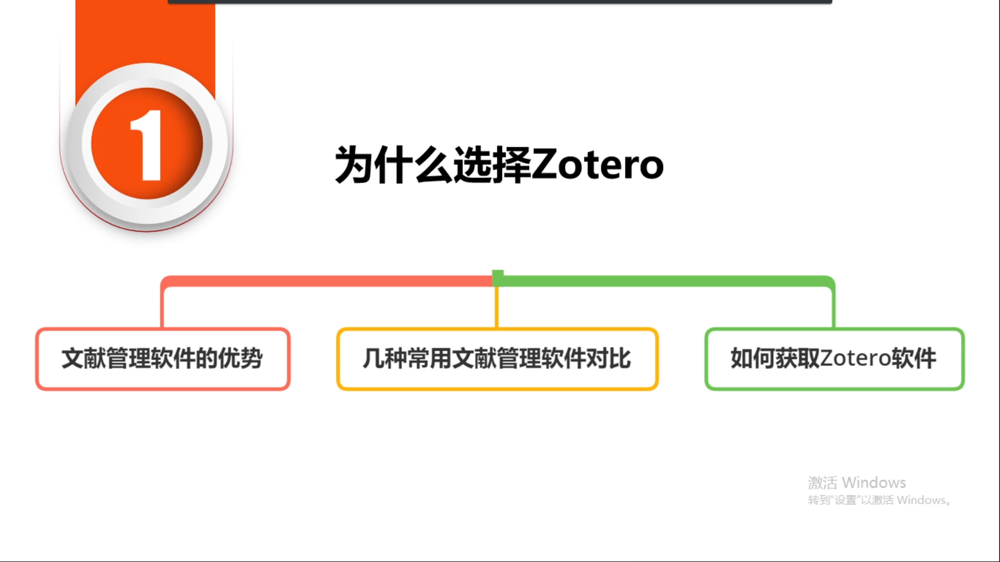
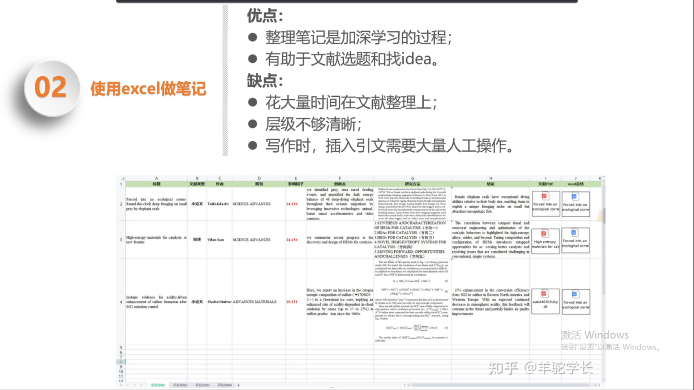
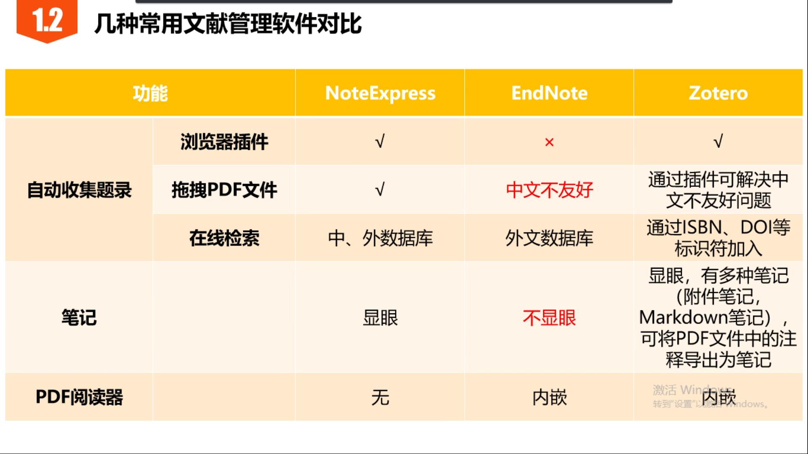
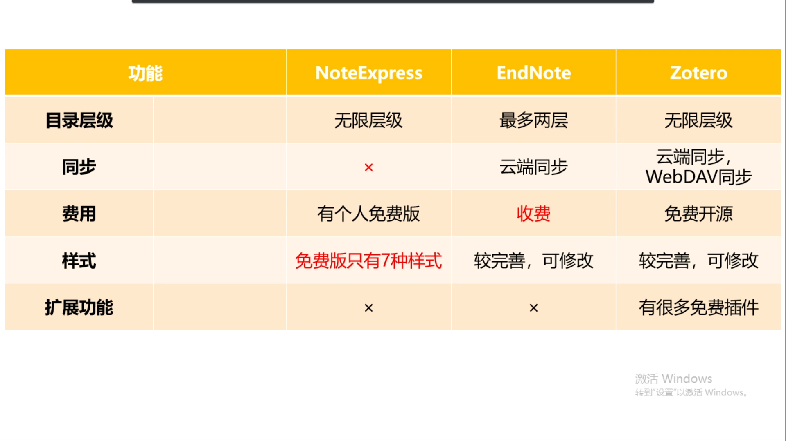
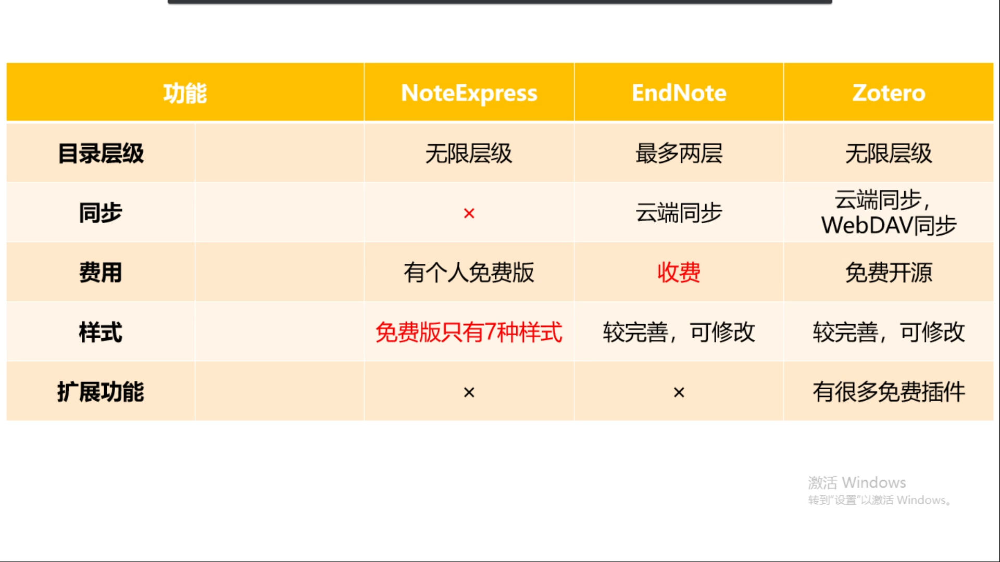

<strong>目录（目前还未更新完）</strong>
  <!-- 注释:这句代码的效果为加粗居中 -->

- [一、仓库Personal-learning-notes-on-Zotero的介绍](#一仓库personal-learning-notes-on-zotero的介绍)
- [二、免责声明：](#二免责声明)
- [三、参考来源：](#三参考来源)
- [四、为什么选择Zotero、安装Zotero（笔记的第一章）](#四为什么选择zotero安装zotero笔记的第一章)
  - [4.1 文献管理软件的优势（Zotero更加强大）](#41-文献管理软件的优势zotero更加强大)
    - [（1）使用文件夹的问题](#1使用文件夹的问题)
    - [（2）使用excel的优缺点](#2使用excel的优缺点)
    - [（3）所以使用文献管理软件](#3所以使用文献管理软件)
    - [（4）几种常用文献管理软件对比——选择Zotero](#4几种常用文献管理软件对比选择zotero)
  - [4.2 如何获取Zotero软件](#42-如何获取zotero软件)
  - [4.3 安装软件Zotero](#43-安装软件zotero)
  - [4.4 安装Zotero的插件（本次以Edge为例，视频介绍了对应谷歌插件的安装方法）](#44-安装zotero的插件本次以edge为例视频介绍了对应谷歌插件的安装方法)

<!-- 注释: 目前给Markdown All in One设的快捷键有，免得忘了：“Ctr+,”：生成目录；“Ctr+；”：更新目录 -->

___  
# 一、仓库Personal-learning-notes-on-Zotero的介绍  
&emsp;&emsp;一个分享如何使用Zotero的笔记的仓库，请直接阅读README.md文件进行学习。 

___  
# 二、免责声明：
&emsp;&emsp;笔记**仅供分享给大家学习使用，不会用作任何商业用途**，如果有人**用作非学习用途构成的侵权行为，与本人无关，请自行承担责任**。

___  
# 三、参考来源： 
&emsp;&emsp;1.该笔记是学习b站up主**浙江工商大学图书馆**分享的视频教程[**文献管理神器之Zotero**](https://www.bilibili.com/video/BV1vS4y1q7uw/?spm_id_from=333.337.search-card.all.click&vd_source=ffb19c330efad3ae5d7d43710d936b1f)，笔记来源于本人。**若有侵权，请联系本人删除**。由于本次笔记字数很多，笔误以及错别字可能很常见，若读者发现笔记有错误，欢迎批评指正。  
&emsp;&emsp;2.其他参考链接：后面有了再补充。  

___  
# 四、为什么选择Zotero、安装Zotero（笔记的第一章）

## 4.1 文献管理软件的优势（Zotero更加强大）
### （1）使用文件夹的问题

### （2）使用excel的优缺点

### （3）所以使用文献管理软件

### （4）几种常用文献管理软件对比——选择Zotero

## 4.2 如何获取Zotero软件

&emsp;&emsp;如图所示，点击[**Zotero的官网**](https://www.zotero.org/)，点击“Download”，再点击左侧的“Download”即可下载软件Zotero（右侧是浏览器插件）（网页加载有点慢，看动图需要耐心点）。（当然本人也将安装包扔到了仓库中）

## 4.3 安装软件Zotero
&emsp;&emsp;首先双击安装包，然后点击Next。之后如下一堆图安装即可。（该过程b站教程没有，只有本人制作截图补充了。）

## 4.4 安装Zotero的插件（本次以Edge为例，视频介绍了对应谷歌插件的安装方法）
&emsp;&emsp;如图所示，打开Edge浏览器，点击[**Zotero的官网**](https://www.zotero.org/)，点击“Download”，再点击右侧的“Zotero Connectors for other browsers”，在“Edge connector”下面点击“Install”，点击“获取”，点击“添加扩展”即可安装Zotero的插件。

&emsp;&emsp;下图是谷歌上Zotero的插件的安装方法。

