
<strong>目录（目前还未更新完）</strong>
  <!-- 注释:这句代码的效果为加粗居中 -->

- [一、仓库Personal-learning-notes-on-Zotero的介绍](#一仓库personal-learning-notes-on-zotero的介绍)
- [二、免责声明：](#二免责声明)
- [三、参考来源：](#三参考来源)
- [四、为什么选择Zotero、安装Zotero    ######（笔记的第一章）######](#四为什么选择zotero安装zotero----笔记的第一章)
  - [4.1 文献管理软件的优势（Zotero更加强大）](#41-文献管理软件的优势zotero更加强大)
    - [（1）使用文件夹的问题](#1使用文件夹的问题)
    - [（2）使用excel的优缺点](#2使用excel的优缺点)
    - [（3）所以使用文献管理软件](#3所以使用文献管理软件)
    - [（4）几种常用文献管理软件对比——选择Zotero](#4几种常用文献管理软件对比选择zotero)
  - [4.2 如何获取Zotero软件](#42-如何获取zotero软件)
  - [4.3 安装软件Zotero](#43-安装软件zotero)
  - [4.4 安装Zotero的插件（本次以Edge为例，视频介绍了对应谷歌插件的安装方法）](#44-安装zotero的插件本次以edge为例视频介绍了对应谷歌插件的安装方法)
- [五、收集题录](#五收集题录)
  - [5.1 在知网、外文等数据库以及网页等上使用Zotero插件收集题录](#51-在知网外文等数据库以及网页等上使用zotero插件收集题录)
    - [5.1.1 up主的操作流程](#511-up主的操作流程)
    - [5.1.2 本人的操作流程](#512-本人的操作流程)
      - [5.1.2.1 下载并安装茉莉花](#5121-下载并安装茉莉花)
      - [5.1.2.2 更改插件版本或代码，让茉莉花插件兼容。](#5122-更改插件版本或代码让茉莉花插件兼容)
      - [5.1.2.3 如果早就安装过茉莉花插件，就尝试刷新茉莉花，并更新zotero connecter(即Zotero插件)。](#5123-如果早就安装过茉莉花插件就尝试刷新茉莉花并更新zotero-connecter即zotero插件)
      - [5.1.2.4 打开浏览器的设置→cookies和网站权限→允许→添加知网的网址。](#5124-打开浏览器的设置cookies和网站权限允许添加知网的网址)
    - [5.1.2\_续 本人的操作流程](#512_续-本人的操作流程)
  - [5.2 通过标识符添加文献](#52-通过标识符添加文献)
  - [5.3 通过标识符添加文献](#53-通过标识符添加文献)
  - [5.4 从剪贴板导入](#54-从剪贴板导入)
  - [5.5 批量导入](#55-批量导入)
  - [5.6 手动添加](#56-手动添加)
  - [5.7 小结](#57-小结)
- [六、管理题录](#六管理题录)
  - [6.1 移动分类、查看包含某文献的所有文件夹](#61-移动分类查看包含某文献的所有文件夹)
  - [6.2 查重功能](#62-查重功能)
  - [6.3 关联功能](#63-关联功能)
  - [6.4 标签功能](#64-标签功能)
  - [6.5 笔记功能](#65-笔记功能)
  - [6.6 RSS订阅：自动抓取期刊文章](#66-rss订阅自动抓取期刊文章)

<!-- 注释: 目前给Markdown All in One设的快捷键有，免得忘了：“Ctr+,”：生成目录;  “Ctr+；”：更新目录 -->

___  
# 一、仓库Personal-learning-notes-on-Zotero的介绍  
&emsp;&emsp;一个分享如何使用Zotero的笔记的仓库，请直接阅读README.md文件进行学习。  <!-- " "表示换行的意思 -->

___  
# 二、免责声明：
&emsp;&emsp;笔记**仅供分享给大家学习使用，不会用作任何商业用途**，如果有人**用作非学习用途构成的侵权行为，与本人无关，请自行承担责任**。

___  
# 三、参考来源： 
&emsp;&emsp;1.该笔记是学习b站up主**浙江工商大学图书馆**分享的视频教程[**文献管理神器之Zotero**](https://www.bilibili.com/video/BV1vS4y1q7uw/?spm_id_from=333.337.search-card.all.click&vd_source=ffb19c330efad3ae5d7d43710d936b1f)，笔记来源于本人。**若有侵权，请联系本人删除**。由于本次笔记字数很多，笔误以及错别字可能很常见，若读者发现笔记有错误，欢迎批评指正。  <!-- " "表示换行的意思 -->
&emsp;&emsp;2.其他参考链接：[**终于解决了zotero抓取中文文献的问题！！！！**](https://blog.csdn.net/hyyyyyyy499/article/details/129372982)、[**Zotero使用记录----3 茉莉花Jasminum插件的下载及功能**](https://blog.csdn.net/weixin_49818157/article/details/125261306)。  

___  
# 四、为什么选择Zotero、安装Zotero    ######（笔记的第一章）######

## 4.1 文献管理软件的优势（Zotero更加强大）
### （1）使用文件夹的问题

### （2）使用excel的优缺点

### （3）所以使用文献管理软件

### （4）几种常用文献管理软件对比——选择Zotero

## 4.2 如何获取Zotero软件
&emsp;&emsp;如图所示，点击[**Zotero的官网**](https://www.zotero.org/)，点击“Download”，再点击左侧的“Download”即可下载软件Zotero（右侧是浏览器插件）（网页加载有点慢，看动图需要耐心点）。（当然本人也将安装包扔到了仓库中）

## 4.3 安装软件Zotero
&emsp;&emsp;首先双击安装包，然后点击Next。之后如下一堆图安装即可。（该过程b站教程没有，只有本人制作截图补充了。）

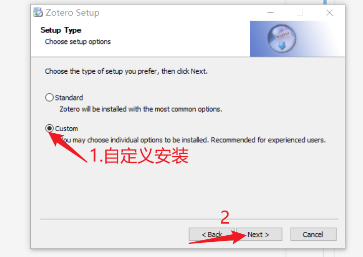
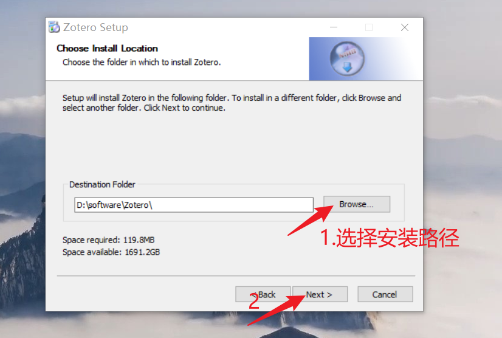
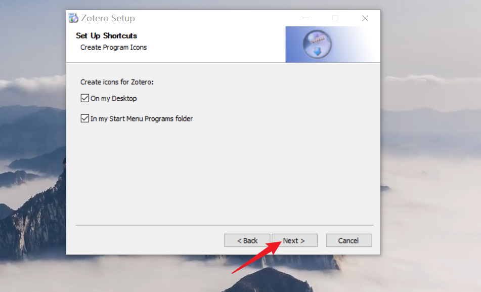
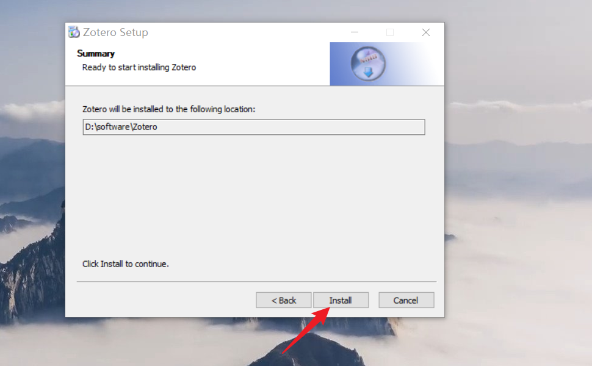
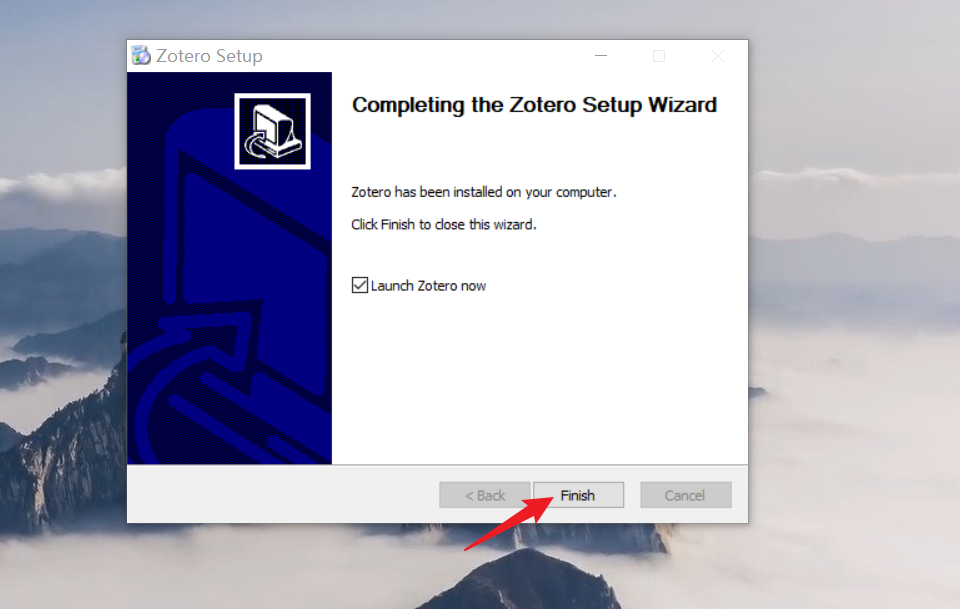

## 4.4 安装Zotero的插件（本次以Edge为例，视频介绍了对应谷歌插件的安装方法）
&emsp;&emsp;如图所示，打开Edge浏览器，点击[**Zotero的官网**](https://www.zotero.org/)，点击“Download”，再点击右侧的“Zotero Connectors for other browsers”，在“Edge connector”下面点击“Install”，点击“获取”，点击“添加扩展”即可安装Zotero的插件。

&emsp;&emsp;之后，如下图，点击Zotero插件的眼睛，让插件在上方栏里进行显示。
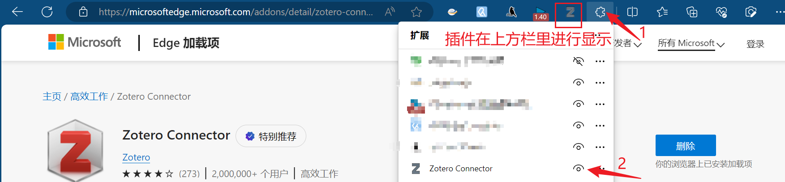
&emsp;&emsp;下图是谷歌上Zotero的插件的安装方法。
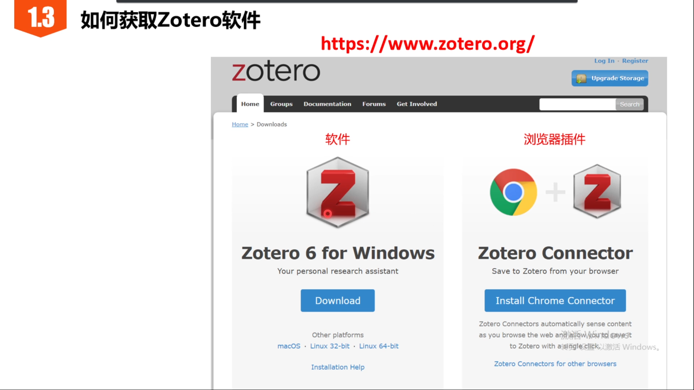
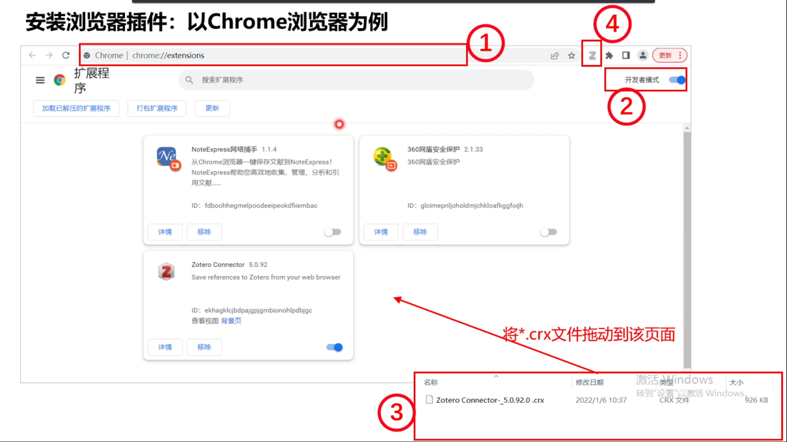

___  
# 五、收集题录

## 5.1 在知网、外文等数据库以及网页等上使用Zotero插件收集题录
### 5.1.1 up主的操作流程
&emsp;&emsp;如下图所示，是知网的检索界面，然后在知网的检索界面的这个页面上有很多篇文献。那么这个文献管理软件Zotero的插件会自动识别这个页面上的文献，如果说这这个页面上有多篇文献的话，它这块右上角的图标是显示为文件夹的。如果说是单篇文献的话，它会显示为个如一张纸的一个图标。

&emsp;&emsp;然后还是如上图所示，我们只要点击这个图标，那么弹出的这个对话框当中，我们可以选择我们想要搜集的文献。然后这时候就到第三步这一块，选择想要将它保存到指定的文件夹目录下面，然后这时候这些文献的题录就会保存下去。需要注意的是，因为这个软件对中文的文献不是那么友好，所以它这个中文的PDF全文像这个多篇文献的页面的话，它是没办法收集起来的。  <!-- " "表示换行的意思 -->
&emsp;&emsp;但是像下图这种单篇文献的这个页面的话，我们直接点击这一块进行这个文献的收集的话，它会将文献的题录以及它的PDF全文直接给收集进来。 

&emsp;&emsp;下图是外文数据库。

&emsp;&emsp;下图是是普通的页面网页，还有些博客之类的，我们都可以将它们的题录信息进行收集。

&emsp;&emsp;收集进来以后，如下图所示，这个就是Zotero的一个主界面。它的所有的内容都在它的主界面上，在主界面的中间这一块内容就是我们刚才搜集的这些信息。

&emsp;&emsp;然后选中某一篇题录之后，在右侧的这一块，它就可以显示这个题录的详细信息，如信息、笔记、标签、关联文献。然后左边这一块，是它的目录栏，也就是说，我们可以将这些文献分类到不同的文件夹目录。对于这个目录栏，我们进行设置的时候，是可以进行无限层级的设置的。  <!-- " "表示换行的意思 -->
&emsp;&emsp;在左下角这一块，就是它的标签栏。我们可以选择某一个标签，之后就可以将对应的标签的这些文献筛选出来。然后上方这一块是工具栏。前两个类似文件夹的图标可以添加它的文献目录、以及文库。默认，我们只有一个文库——"我的文库"。如果我们想要跟团队成员进行共享的话，我们可以创建多个文库。然后这一块的加号，就是说我们可以增加题录。然后类似放大镜的图标是高级检索的。之后上面就是一些设置。

### 5.1.2 本人的操作流程
&emsp;&emsp;（注：请在确保能使用常规方法获取各个数据库的内容后，比如通过高校的途径获取数据库后，再进行下面如本人所示的操作。）  
&emsp;&emsp;由于Zotero版本、知网等的更新，上面的方法可能会失效。于是我们按着步骤进行实际演示。第一步就出现问题了，于是本人去网上不断搜索，寻找方法。参考链接[**终于解决了zotero抓取中文文献的问题！！！！**](https://blog.csdn.net/hyyyyyyy499/article/details/129372982)和链接[**Zotero使用记录----3 茉莉花Jasminum插件的下载及功能**](https://blog.csdn.net/weixin_49818157/article/details/125261306)给出下面的方法。
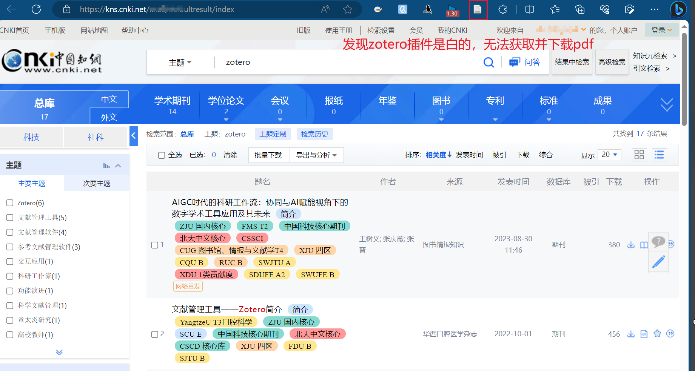

####  5.1.2.1 下载并安装茉莉花
&emsp;&emsp;如下图所示，首先进入[**茉莉花插件的下载地址**](https://github.com/l0o0/jasminum/releases)，选择最新的（更正：**根据后面的操作出现的问题发现需要选择0.2.7**）版本，点击“jasminum.xpi”即可下载茉莉花插件。

&emsp;&emsp;然后如下图所示安装茉莉花插件。（发现不兼容）
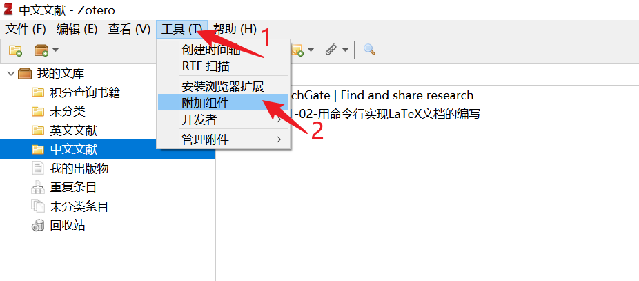
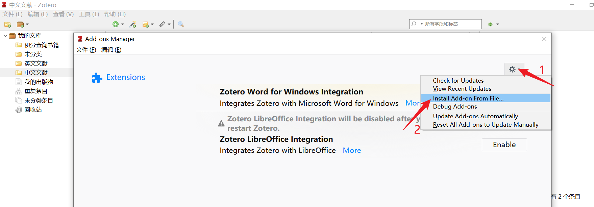
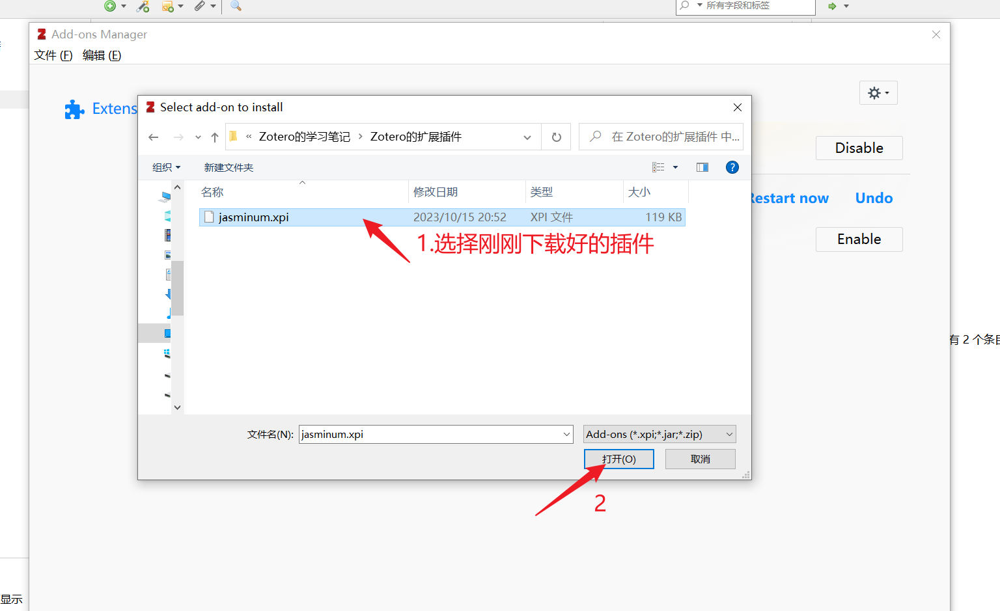
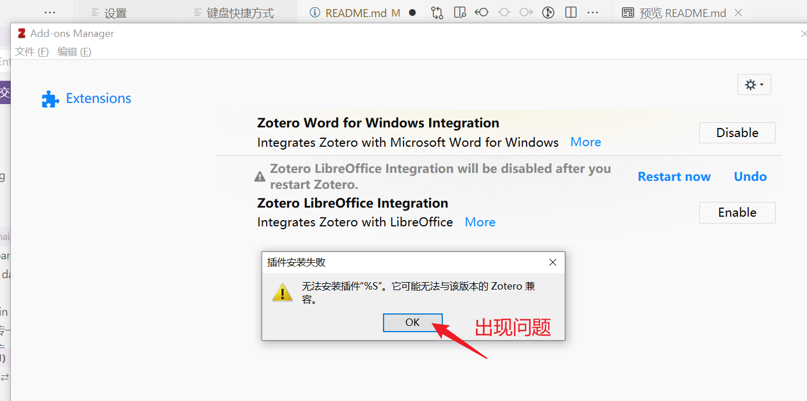

####  5.1.2.2 更改插件版本或代码，让茉莉花插件兼容。
&emsp;&emsp;查了一阵在某个角落的评论区里说茉莉花插件的旧版本就可以，于是按照5.1.2.1的方法去下载**版本0.2.7**的插件，然后再按照5.1.2.1的方法安装，发现成功安装上茉莉花插件。（注：下面第二张图紧跟着5.1.2.1的倒数第二张图）（其他插件如果不兼容可能会参考参考链接[**Zotero 6.0插件不能用了？不兼容？原来原因在这**](https://www.bilibili.com/video/BV1XL4y177vE/?spm_id_from=333.337.search-card.all.click&vd_source=8ab9b0364fb2fc4f257faf0a13008080)，反正茉莉花插件参考不了。）
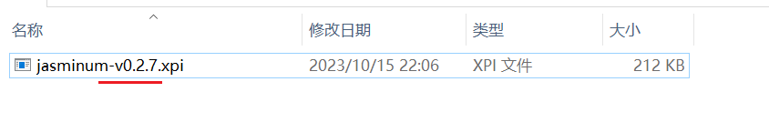
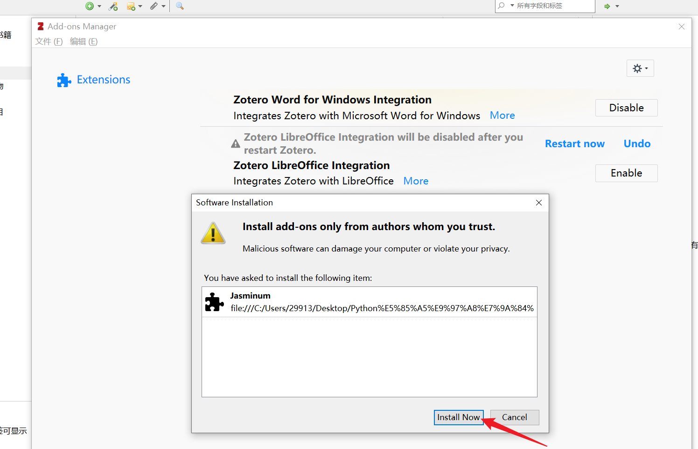
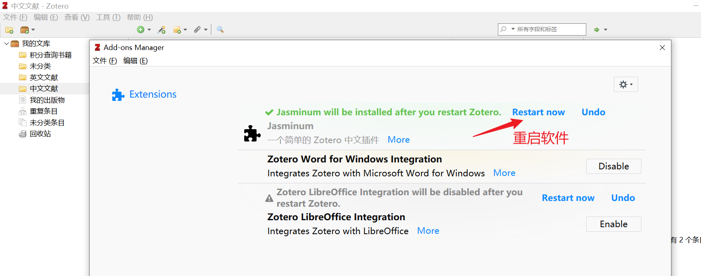

####  5.1.2.3 如果早就安装过茉莉花插件，就尝试刷新茉莉花，并更新zotero connecter(即Zotero插件)。
&emsp;&emsp;刷新茉莉花插件的步骤（Zotero插件更新的话，按照前面的方法重装就行）：首先，点击编辑里的首选项。
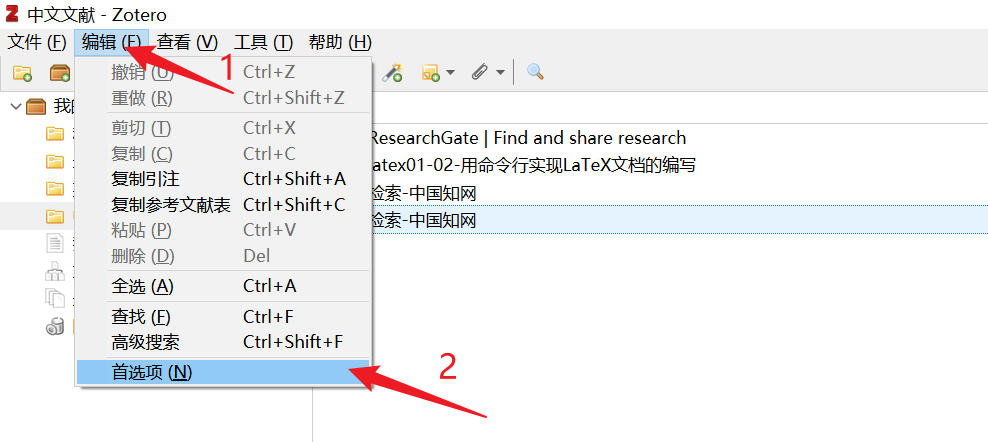
&emsp;&emsp;然后选择“茉莉花”，点击“非官方维护中文翻译器”，点击“更新全部”，等待更新完毕后点击“OK”。

&emsp;&emsp;之后，如下图所示更新浏览器翻译器的信息。右键Zotero插件，然后点击“扩展选项”。点击“Advanced”，之后点击更新翻译器“Update Translators”即可。

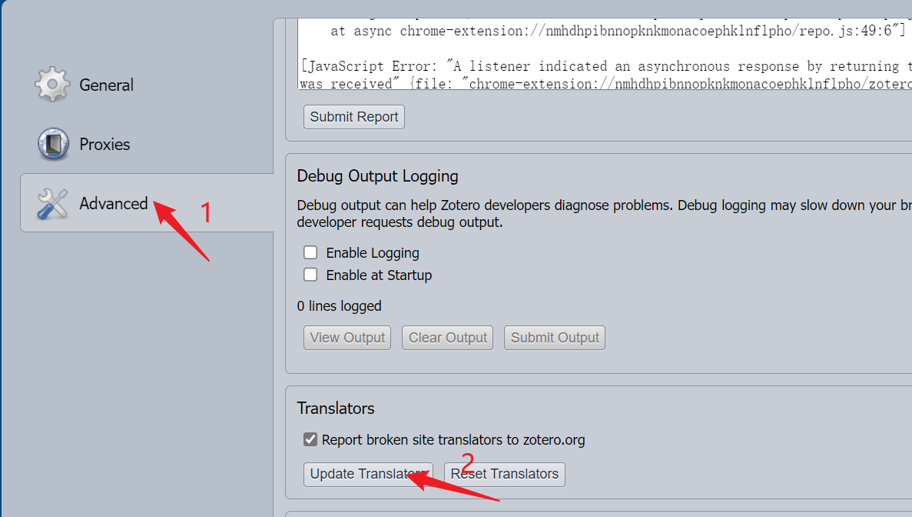

####  5.1.2.4 打开浏览器的设置→cookies和网站权限→允许→添加知网的网址。
&emsp;&emsp;步骤如下几张图所示。（注：知网链接为“https://www.cnki.net”）
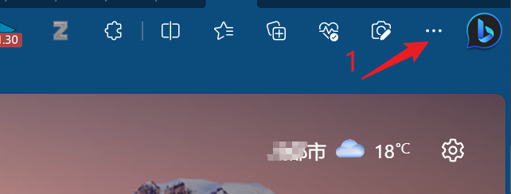

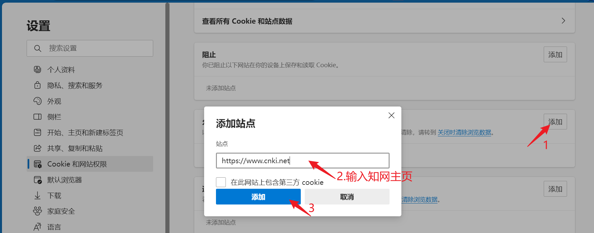

&emsp;&emsp;（注：上一张图鼠标滚动了下才看到提示，然后才截的图。）

### 5.1.2_续 本人的操作流程
&emsp;&emsp;注：经过上面的操作后，请重启浏览器，然后直接进入知网检索页面（`“https://kns.cnki.net/kns8/defaultresult/index”`），这样在知网搜索后Zotero插件才会显示为黄色文件夹。如果进入知网官网后再进入检索页面，发现Zotero没有变成黄色文件夹，此时Zotero插件无法批量捕获知网的pdf文件。下面两张动图给出了对比。
<!-- 注释: 下面的两个div块插入了两张居中的图 -->

  
  
<em>直接进入检索可正常使用Zotero插件的示意图</em>

  
  
<em>如果进入知网官网再进入检索页面，发现Zotero没有变成黄色文件夹</em>

&emsp;&emsp;接着，我们重新进入知网上检索页面检索一下需要的内容。发现插件Zotero已经变成黄色的文件夹，此时可以如下图所示将知网上的多个文献收集到软件Zotero中。(为了节省学校的资源，本人只选了三个。)

&emsp;&emsp;再同样的方式收集英文数据库的文献。

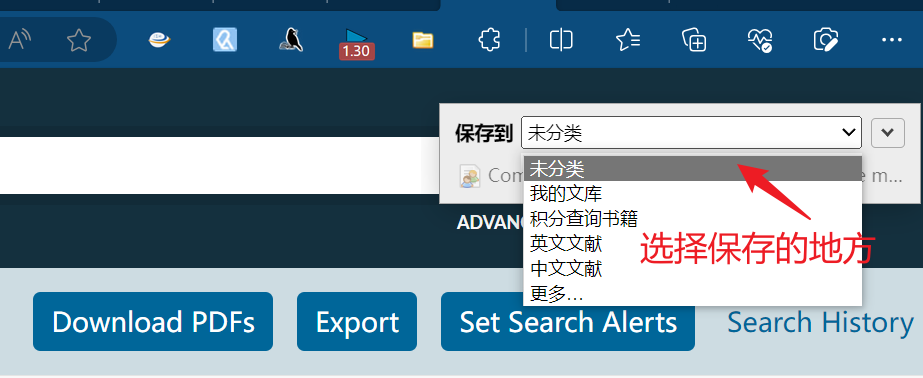
&emsp;&emsp;之后到Zotero查看，发现文献的pdf等都收集到Zotero里面了。
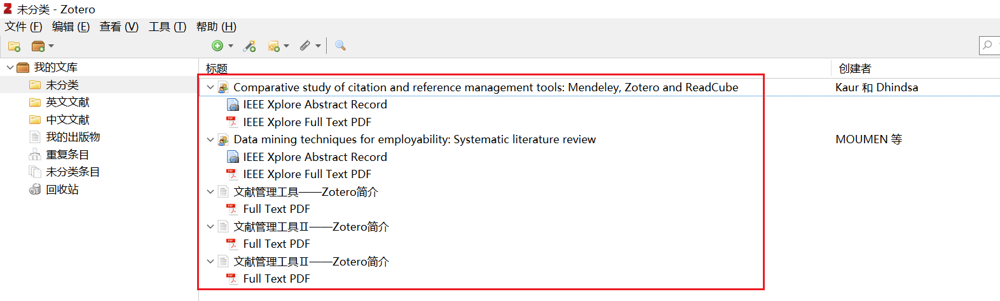

## 5.2 通过标识符添加文献
&emsp;&emsp;第二种添加题录的方法是通过标识符添加的。这里的标识符，指的是可以根据图书的ISBN编号、DOI号、PubMed数据库的PMID、arXiv数据库的ID或者ADS条码号。
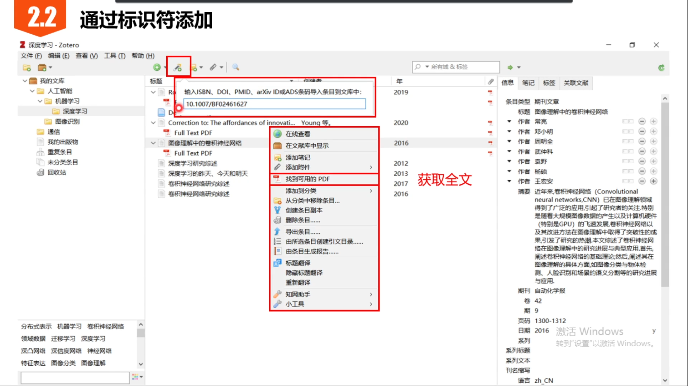
&emsp;&emsp;如上图所示，它给出了使用DOI号添加题录的示意图。在我们我们直接输入DOI号，一般它就可以将这篇文献的题录提取出来，加入到我们的这个文库里面。如果加入进来的只有它的题录信息，没有PDF全文的话，那么我们可以点击右键，然后点击“找到可用的PDF”来获取它的全文信息。

## 5.3 通过标识符添加文献
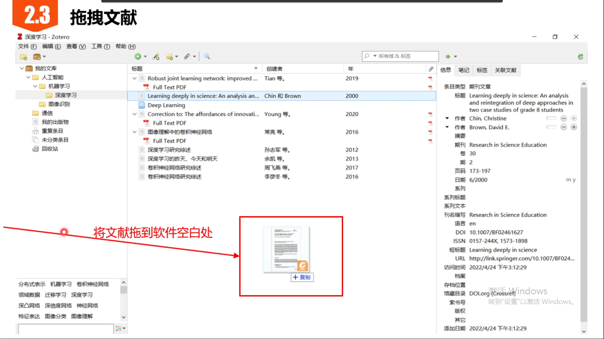
&emsp;&emsp;第三种方法，就是在我们已经下载了PDF文献之后使用的。我们只要将PDF文献直接拖拽到软件Zotero的空白处。
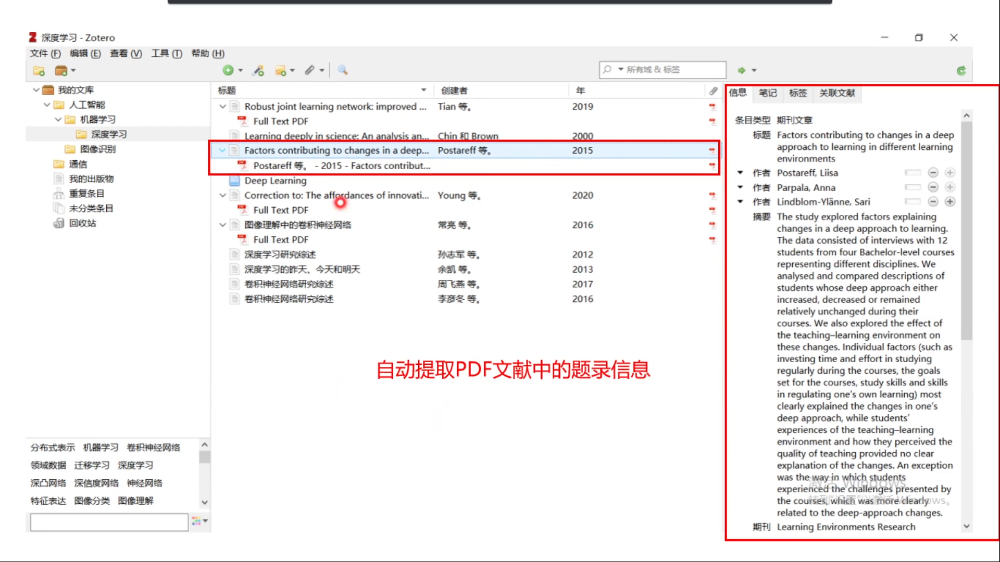
&emsp;&emsp;那么在这个空白页面呢，如上图所示，Zotero就可以自动将这篇文献的题录信息直接进行提取。

## 5.4 从剪贴板导入
&emsp;&emsp;第四种方法就是从剪贴板导入。
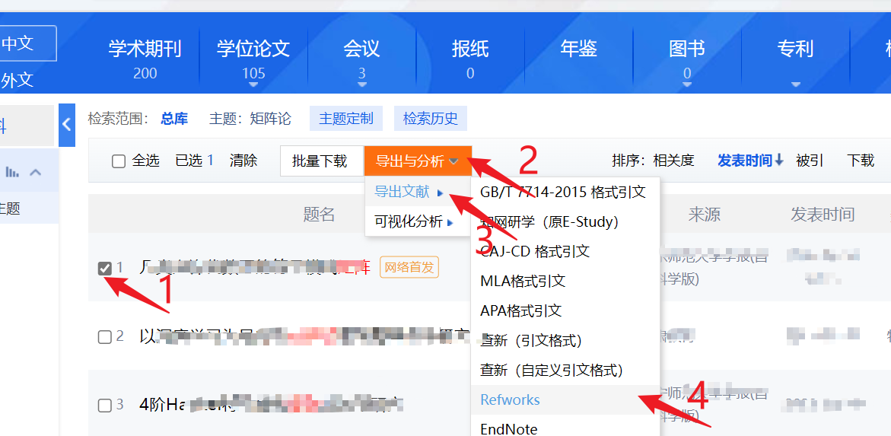
&emsp;&emsp;先按照上图的操作得到下图的页面。假如我们需要将知网的这篇文献导出到参考文献。于是选择格式Refworks，然后再将参考文献复制到剪贴板。
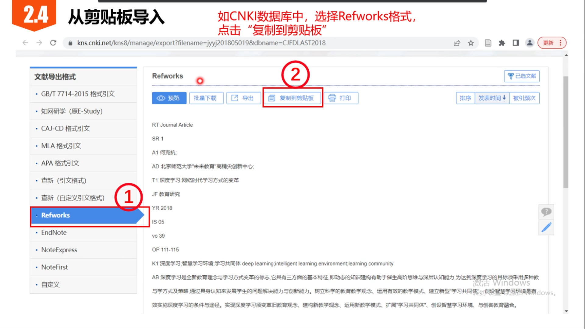
&emsp;&emsp;然后再回到这个软件Zotero里面，点击"文件"、“从剪贴板导入”（或者使用快捷键CTRL+shift+alt+i实现“从剪贴板导入文献”的功能）。通过这种方式导入的话，它只添加了题录信息，而没有添加PDF全文。那么我们可以通过添加附件或者是通过右键找到可用的PDF来添加它的PDF全文信息。
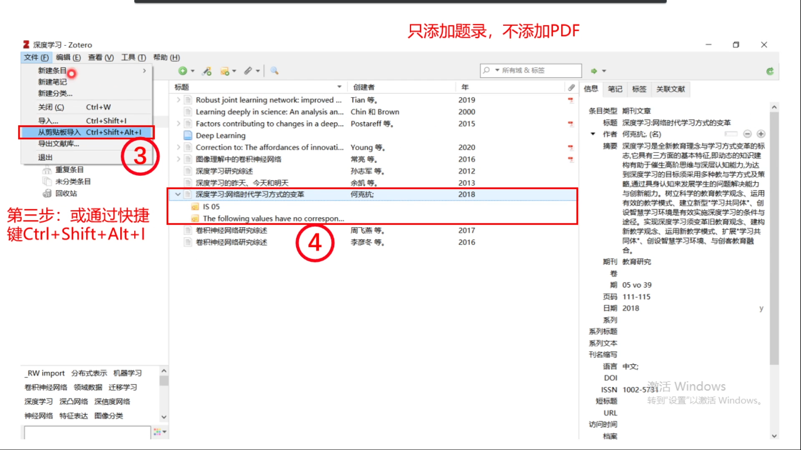

## 5.5 批量导入
&emsp;&emsp;第五种方式，批量导入。对于批量导入，我们可以在某一个数据库里面，选择多篇文献，然后将它们导出到参考文献里面。当文献选择完成之后，我们可以选择格式Refworks，然后再将它们导出。
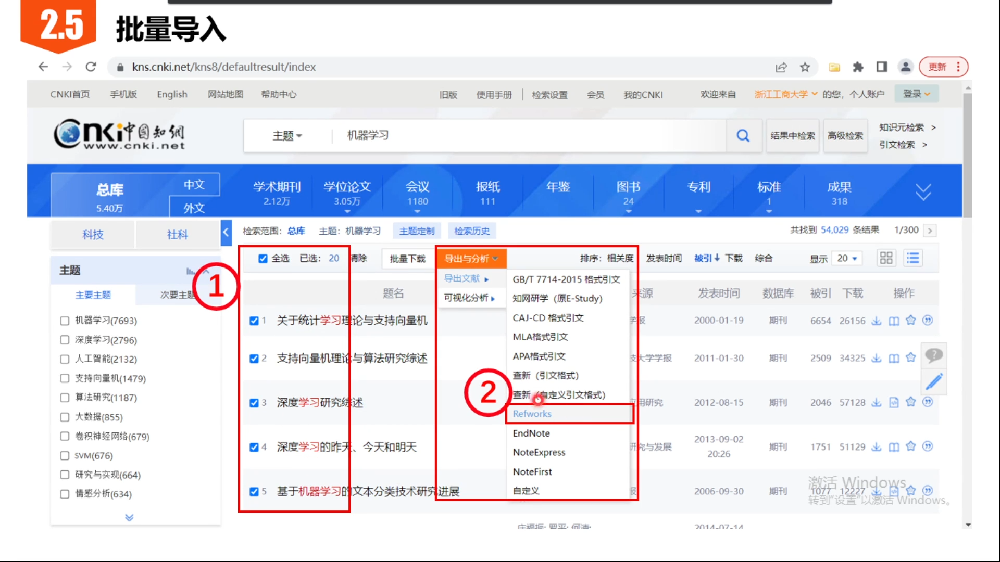
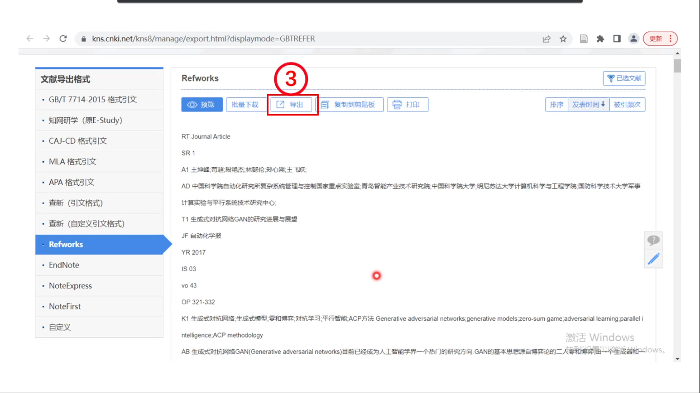
&emsp;&emsp;这时候导出的是多篇文献的信息，然后在软件Zotero里面的文件导入这一块将多篇文件进行导入。导入的时候需要注意的是，图中右边的文件类型需要选择我们前面对应的Refworks。然后再将刚才下载下来的这个txt文档进行导入.
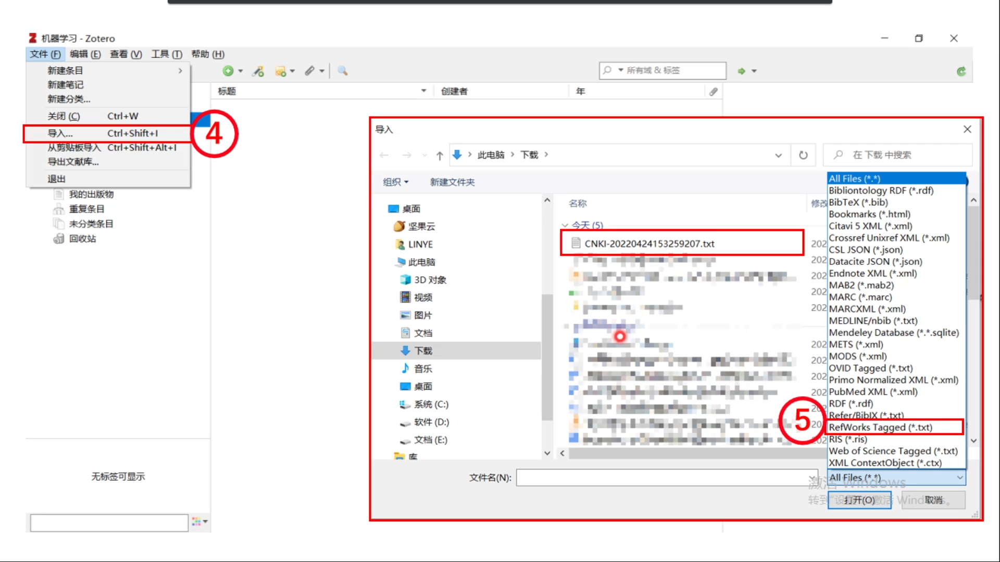
&emsp;&emsp;下一步，首先可以勾选"将导入的集合和项目放入新集合中"。然后这时候，在Zotero主页面这一块就多了一个新的文件夹，这个就是刚才导入的这些文献。
&emsp;&emsp;假如我们不想要将这些文献放在这个新文件夹中。我们可以通过“对准该文件（或文件夹）按住shift键+鼠标左键”的方式，直接将这些文献拖动到我们想要将它放置在某个文件夹目录中就可以了。
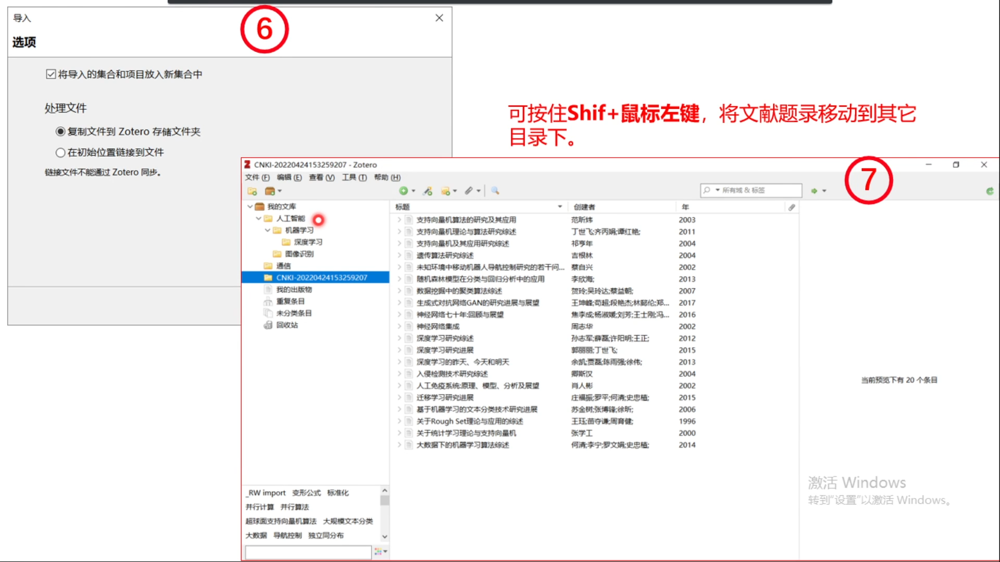

## 5.6 手动添加
&emsp;&emsp;最后一种添加方式，手动添加。手动添加的话，一般来说不建议采用.这种方式，我们可以在这一块点击加号，然后选择要添加的文献类型。（或者是通过文件选择新建条目，选择要添加的文献类型。）

&emsp;&emsp;然后这时候右侧这一块就多了一个空的条目。然后我们将题录信息进行补全就可以了。

## 5.7 小结
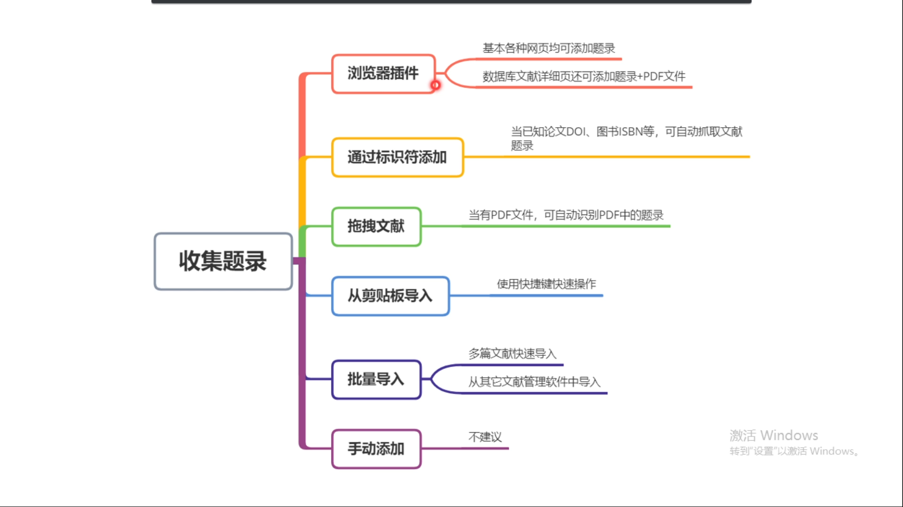
&emsp;&emsp;我们来总结一下，刚才说的这些收集题录的功能呢，可以通过浏览器插件，这种方式比较推荐，使用起来比较方便，用途也较广一点。 
&emsp;&emsp;对于第二种方式，通过标识符收集题录。当网页速度可能比较慢。然后我们知道它的DOI的时候，此时我们可以通过这种方式进行添加。 
&emsp;&emsp;至于第三种方式，就是说当我们有PDF文件的时候，那么我们就可以直接拖拽进去。 
&emsp;&emsp;然后还可以通过剪贴版导入或者是批量导入。批量导入的话，我们是可以在数据库上直接检索多篇文献。但是，其实数据库上检索多篇文献，我们也可以通过浏览器插件直接导入。那么对于从其他的文献管理软件进行导入的话，我们可以选择这个批量导入。 
&emsp;&emsp;好，最后一种是手动添加。

# 六、管理题录
&emsp;&emsp;接下来我们来看一下对题录进行管理。
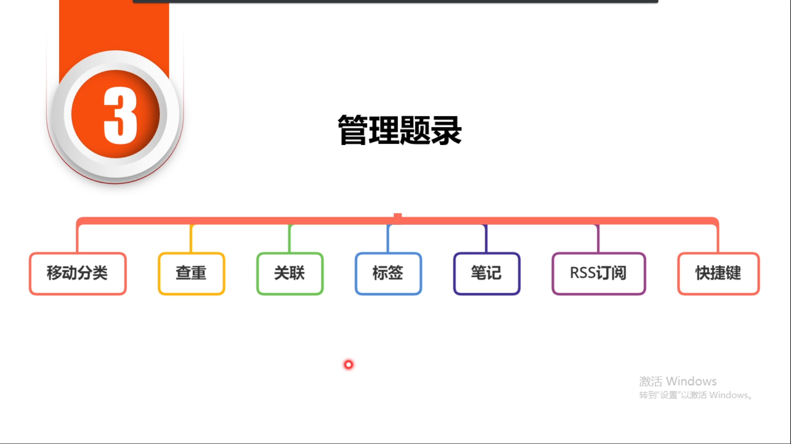

## 6.1 移动分类、查看包含某文献的所有文件夹
&emsp;&emsp;法1：对于有些题录呢，我们就是将它们放在某个文件夹目录下面。这些目录其实也起到一个分类的作用。但有时候我们不想将它放在这个目录下面。前面我们也提到过，我们可以“按住shift+鼠标左键”，直接将这篇文献拖动到其他文件目录下面。 
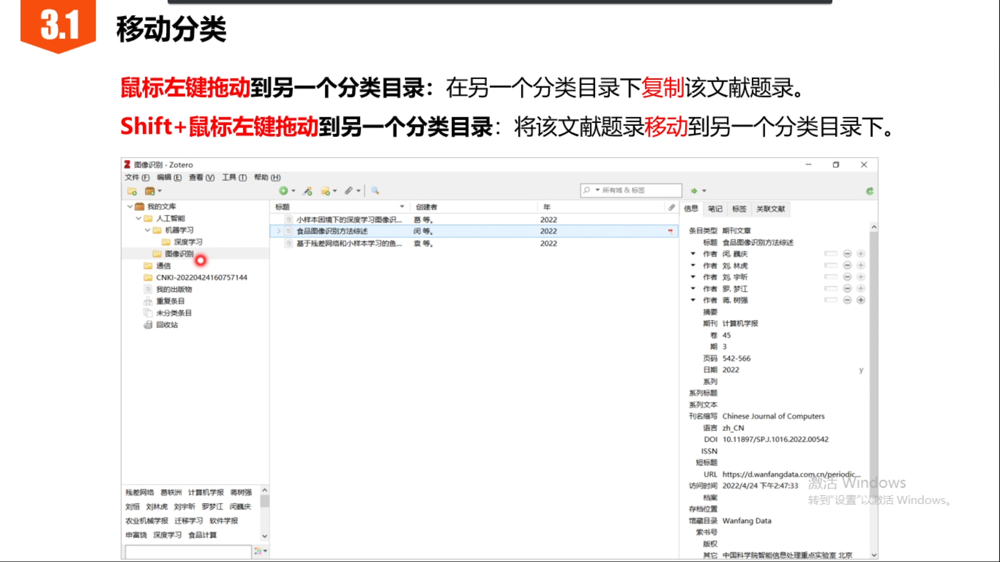
&emsp;&emsp;那么如果我们不按shift，直接是鼠标左键拖动的话，它其实相当于是在另一个文件夹目录下面**复制**了这篇文献的题录信息。 
&emsp;&emsp;法2：其实我们也可以通过点击右键，然后选择“添加到分类”，或者是“从分类中移除条目”，通过这种方式，然后将它添加到某一个文件夹目录下面。 
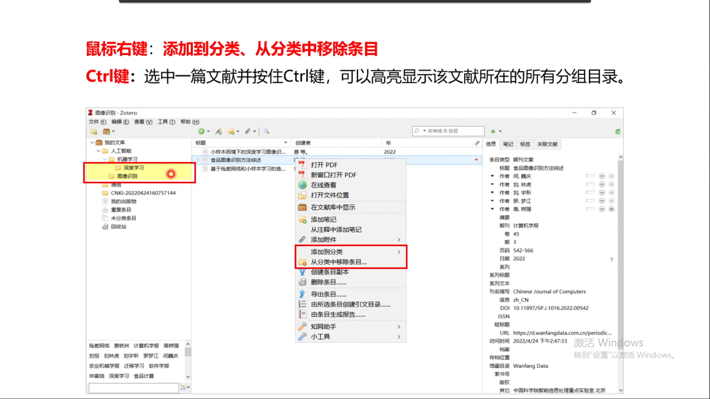
&emsp;&emsp;然后对于一篇文献，我们如果想要知道它在哪些文件夹目录下面的话，我们可以先选中该文献,然后按住Ctr键。这时候，在文件夹目录这一块就会高亮显示这篇文献所对应的这个分组目录。 

## 6.2 查重功能
&emsp;&emsp;第二个功能就是查重功能。当我们导入了多篇的文献，有时候可能有一些重复的文献导入进来了。这时候如下图所示,我们就可以直接在左侧点击“重复条目”，就可以将重复的文献信息给筛选出来。 

&emsp;&emsp;如果“重复条目”没有显示的话，我们可以在“我的文库”处右键，选择“显示重复条目”，之后“重复条目”就显示出来了。 
&emsp;&emsp;显示出来以后，每选中一篇文献，它其实每次选中都是该篇文章的所有题录（注：这里本人发现跟视频描述有略微区别，有所改动），在选中以后我们可以进行合并。 

## 6.3 关联功能
&emsp;&emsp;第三个功能就是关联功能。什么是关联功能？就是我们可以将某一篇文献跟其他文献进行关联，就比如说是不同版本的文献，或者是同一本书的不同章节或者同一个项目的不同文献之间，我们可以建立一些关联。 
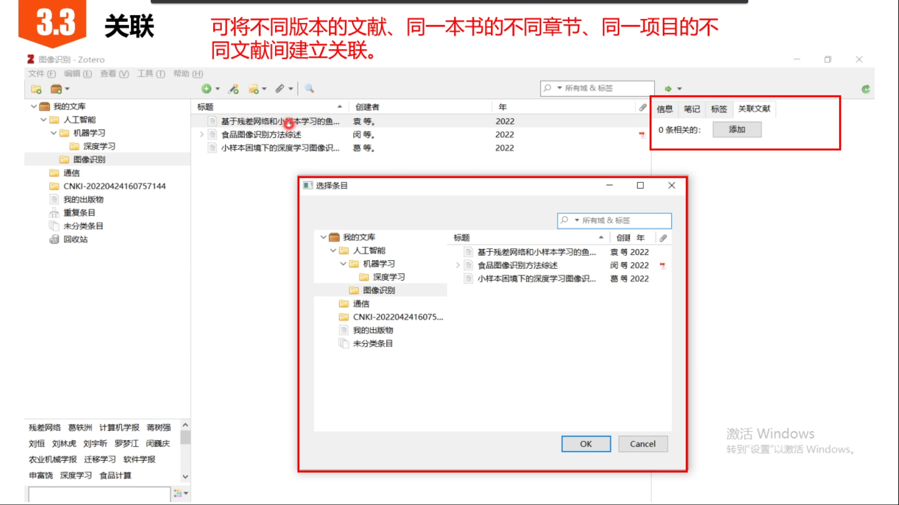
&emsp;&emsp;如上图所示，比如说在这篇文献下面，我们在关联文献这一块点击“添加”，然后添加其他文献。那么这时候这篇文献跟另一篇文献之间就建立了关联，它的关联之间是**双向的**，如下图所示。假设我们将文献A与文献B进行关联，点击文献A，我们可以在关联文献中看到文献B；点击文献B，我们可以在关联文献中看到文献A。 
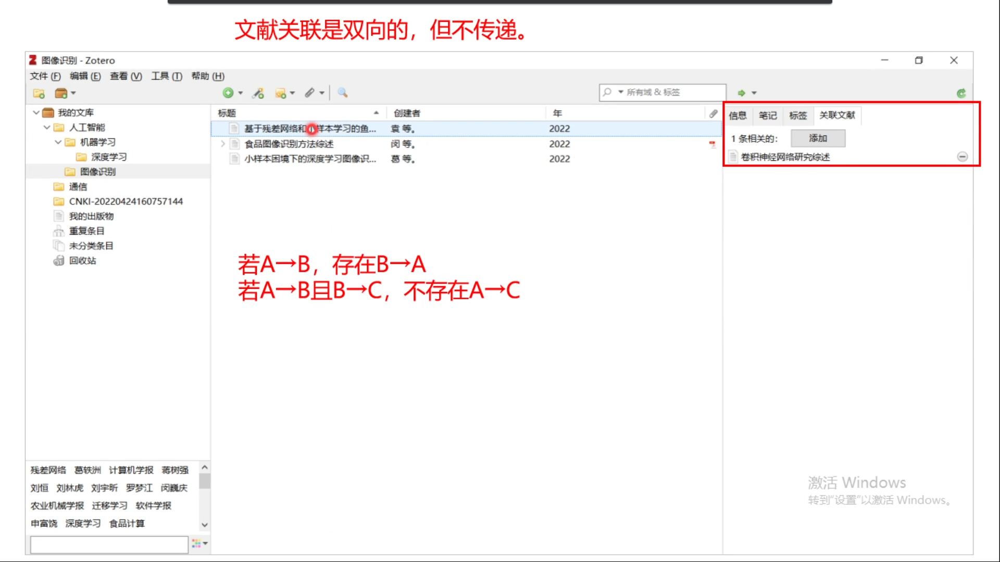
&emsp;&emsp;但是关联并**不传递**。比如，如果文献A关联到B,文献B关联到文献C，那么文献A是不会关联到文献C的。 

## 6.4 标签功能
&emsp;&emsp;第四个功能，标签功能。 
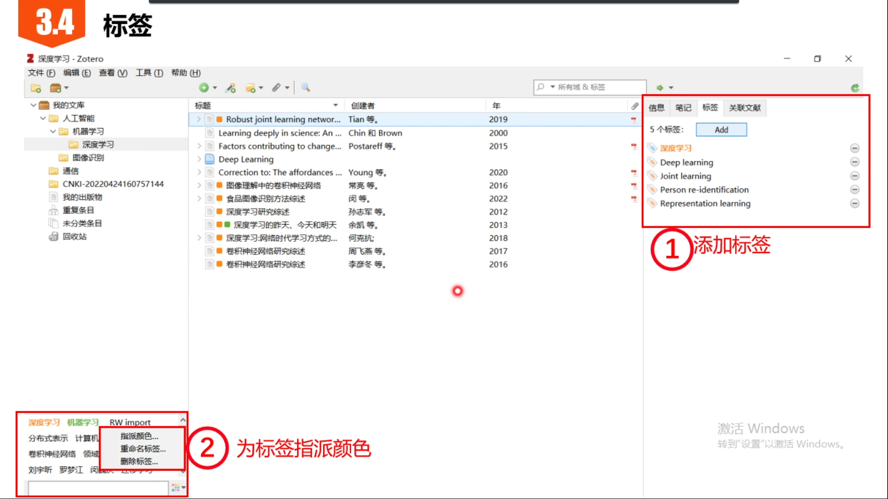
&emsp;&emsp;如上图所示，对于标签功能的使用，就是选中某一篇文献，我们直接在标签这一块，点击"Add"就可以添加标签，然后下面的减号“-”就可以将它的某些标签给删除掉。之后添加后的标签呢，它会显示在左下角这一块，在左下角的这个标签，我们可以对它们指派颜色。就是说我们可以设置这个标签为不同的颜色。 
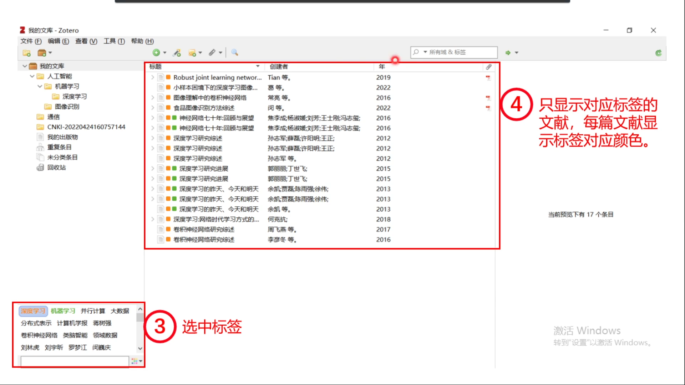
&emsp;&emsp;如上图所示，这时候我们选中某一条标签，那么中间这一块的文献就会显示出来这个标签下面的这些文献。然后在这些文献的前面，它就会将有颜色的这些标签的对应所有颜色给它显示出来。 
&emsp;&emsp;我们在设置一些重要文献的时候，可以给这些文献设置好标签。然后这些文献就可以一目了然地一下子就可以被找到。 
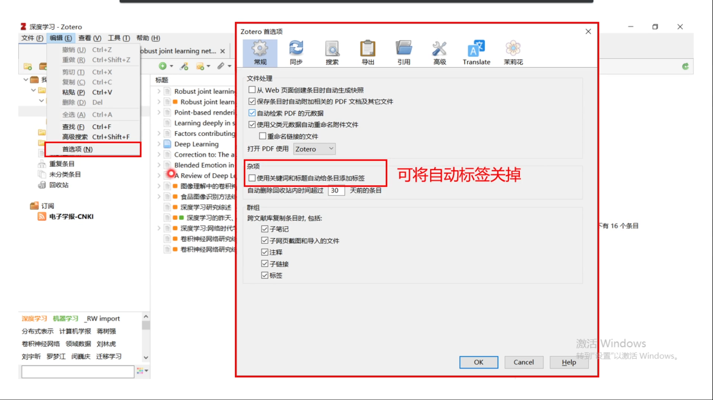
&emsp;&emsp;对于我们导入的文献，或者说是通过浏览器插件收集的这些文献。那么它们的标签会根据它们的关键词、标题自动给文献添加标签。如果我们不想让Zotero自动添加标签的话，我们可以在Zotero"编辑-首选项-常规"这一块将这个选项(即“基于关键词和主题词自动为条目添加标签”)给勾选掉。 
&emsp;&emsp;嗯，需要注意的是，Zotero这个软件，它的很多设置可以说都是在“编辑-首选项”这个页面进行设置的。接下来我们要讲的像同步功能呀，还有它的一些引用、高级文件夹这些都是在“编辑-首选项”这一块进行设置就可以了。 

## 6.5 笔记功能
&emsp;&emsp;接着是它的笔记功能。对于Zotero当中的笔记，它具体分为三类笔记。 
&emsp;&emsp;第一类就是PDF附件或者是其他类型的附件，它会自带一个笔记，如下图所示。在右侧的这一块，我们可以添加笔记。第二类笔记，就是它的独立的条目笔记。第三类笔记就是注释笔记。 
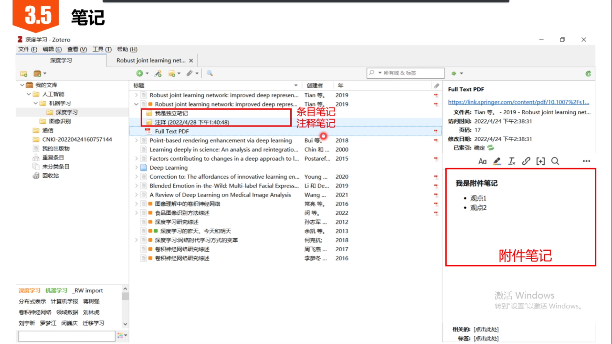
&emsp;&emsp;我们先来看一下**注释笔记**。如下图所示，软件Zotero内置了一个PDF阅读器。我们可以将它的PDF全文用这个PDF阅读器打开。打开以后，我们可以在上面做一些注释，比如高亮文本、或者是添加笔记（就是说添加某一段内容的一个评论，或者是选择区域。选择区域的话，就是我们可以选择某一块图片或者表格。那么这些注释内容就会在左侧的这一块的注释栏进行显示。）。然后像左下角这一块笔记的话，它就是一个图片，我们可以将它加入到注释里面。 
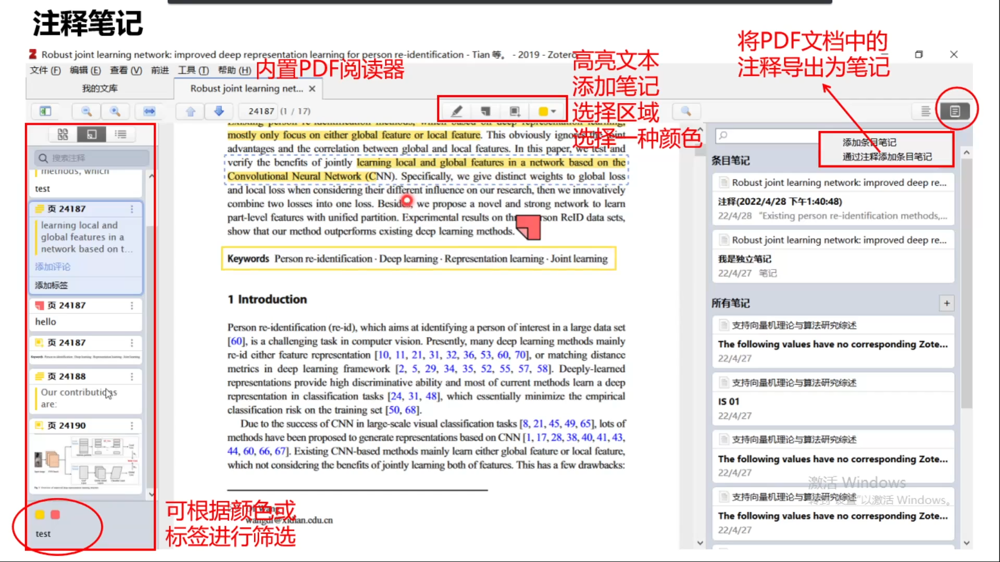
&emsp;&emsp;那么对于这些高亮文本以及评论呀，还有类似这些图片的区域这种注释，我们可以对它们设置某一种颜色，也可以对它们添加标签。那么对于这些注释内容，我们可以通过它们的标签或者是它们注释的颜色，从而进行筛选。 
&emsp;&emsp;然后右侧这一块呢，如上图所示，我们可以点击用圈圈出来的这个东西，这一块添加条目（下图中的加号），选择添加“通过注释添加条目笔记”。这样，就可以将这些注释内容添加到一条独立的笔记里面。 
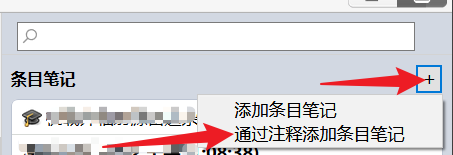
&emsp;&emsp;如下图所示，添加完成的笔记，它会在“注释”这一块存储注释笔记。 
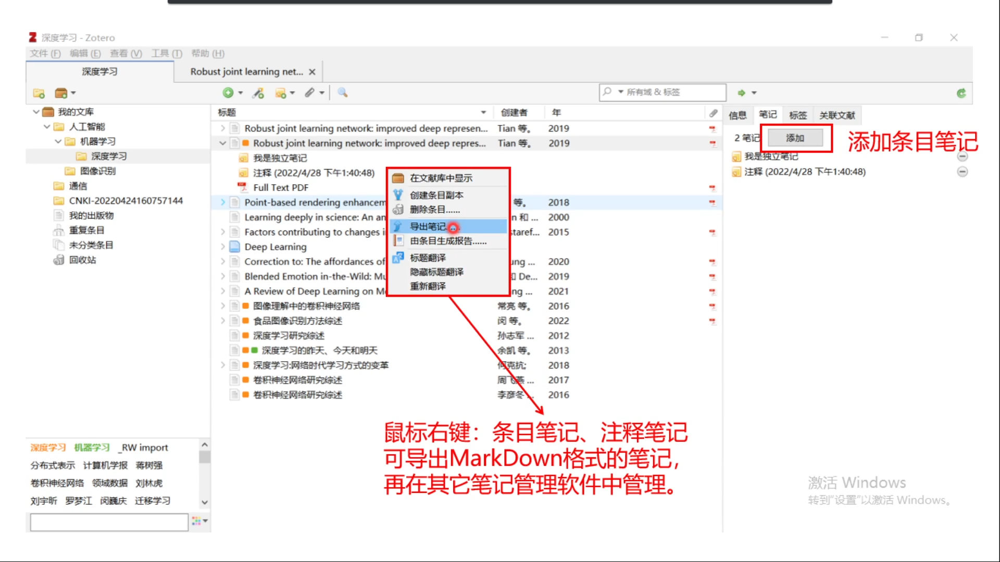
&emsp;&emsp;然后对于它的注释笔记，还有它的条目笔记呢，我们可以将它们进行导出。导出的话，可以导出为Markdown格式的笔记。然后这个笔记呢，我们可以在其他的管理软件当中进行管理。像下图这个就是导出的笔记，然后在笔记管理软件Obsidian里面进行打开的效果。 
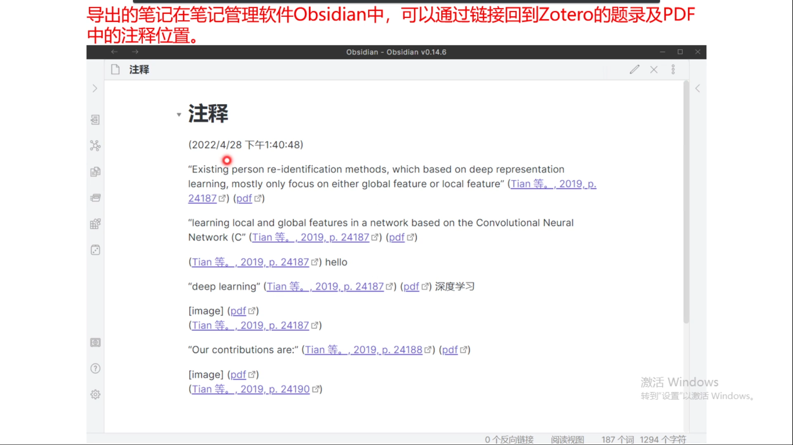
&emsp;&emsp;然后在Obsidian这个软件当中，我们可以看到有它的超链接。点击超链接以后，它就会自动跳转到Zotero的条目的注释的那一块。 
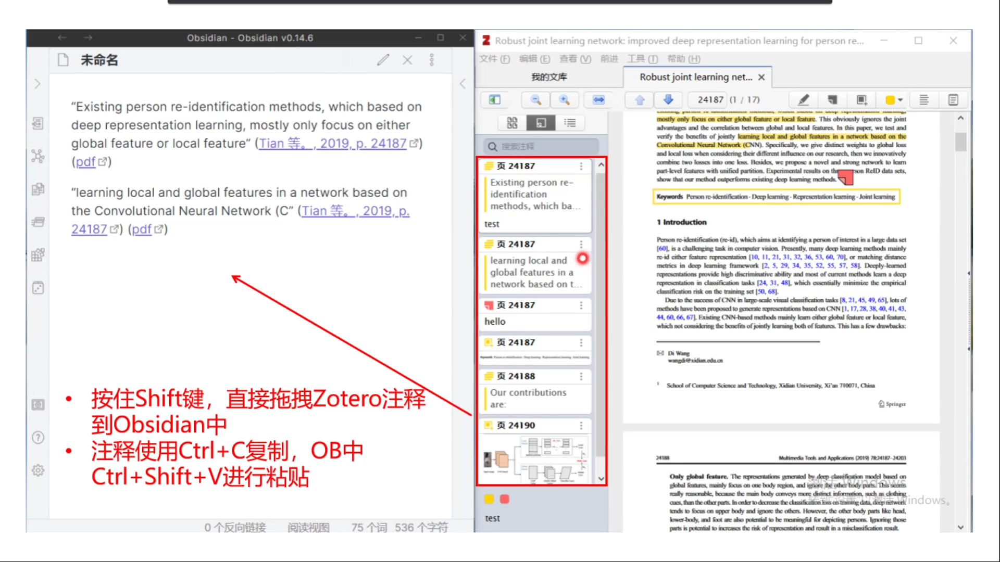
&emsp;&emsp;当然我们不一定通过这种方式将它导出笔记，这也比较麻烦。我们可以直接将Zotero跟这个笔记管理软件Obsidian打开，然后直接按住Shift键，然后将这个注释笔记直接给拖过去，然后就可以在这个笔记管理软件Obsidian里面看到，也可以直接点击超链接，就跳转到这个文库的这个条目的对应位置。当然，也可以点击高亮文本，也能跳转。 

## 6.6 RSS订阅：自动抓取期刊文章

点击这个PDF就是跳转到这一块PDF内容的就是这一块。高亮文本的这个注释这一块。第六块。第六个功能呢就是ISS订阅我们有时候就是要追踪某些期刊文章。那我们通常的做法呢，就是说去网页上，然后就是实时的去呃刷新检索，然后去看这篇文。呃，这本期刊有没有新的文献，有没有收录进来。那么可以通过这个软件，我们可以追踪期刊，具体的做法呢，就是可以通过这一款就新建订阅来自url。然后这一块输入UIL地址，然后嗯设定它的更新时间可以是二十四小时或者四十八小时等等。那么这个UIL地址呢，我们可以在每一本期刊的它的数据库页面可以找到。比如说像这本期刊，我们在知网上找到这本期刊的这个期刊页面。然后在这个右上角这一块ISS订阅我们点击它就可以获得这本期刊的ISISS订阅的网址。然后我们将这个网址放在这个UIL这个地址里面，然后就可以设置成功。这个呢就是它自动抓取的这个效果。第七个功能呢就是快捷键快捷键功能呢刚才有提到这两个快捷键，就是鼠鼠标左键直接拖动文献到另一个嗯文件目录。下面的话就相当于是复制文献按住shift键进行拖动的话，它是是直接将它进行移动到另一个文件目录。下面然后选中某一篇文献按culture键的话就可以高亮显示这篇文献所在的分组目录嗯CTRL加shift加else加i就是从剪贴板导入CTRL加t呢这个呢是可以切换显示翻译前后的标题。这个在后面的呃PDFtranslate这个插件里面会讲到，然后加号呢是展开所有的目录，减号呢是折叠所有的目录。这个大家在用的时候，到时候再对照着去看就可以了。管理题录这一块主要的功能呢就是移动分类，还有就是对重复的文献进行查重。对不同版本的文献或者同一本书的不同章节，同一项目的不同文献，我们可以进行关联文献，还可以设置标签，标签，可以指派颜色好笔记。笔记的话嗯，特别是需要注意的是，注释笔记就是它内置PDF阅读器。我们可以将PDF当中的注释找出为笔记。然后ISS订阅的话，可以追踪某一本期刊的发文情况。还有就是快捷键。我们嗯再接着进入第四部分，就是在论文中插入英文。当我们安装完锁定位这个软件以后，一般来说在我们的officeword里面，它会自动安装这个sotao的word插件，然后安装完成以后，这边是会显示sotailo的。我们添加影文的话，就只需要先将光标放置在要插入的影文处，然后点击这个添加影文这个按钮，接着再选择。我们要添加这个引文的，它的样式一般来说我们要添加的样式的话是呃中文文献的话，一般都是GBT七七幺四二零幺五。这个样式我们选择它，然后点击下一步，这时候会出现一个检索框，在检索框当中输入我们想要插入的这个引文的标题，然后再检索出来以后，点击这一块就可以了。或者呢我们可以通过这一块的经典视图，然后打开这个对话框，在对话框当中选择我们所需要添加的这一篇文献的引文，然后点击确定这时候在刚才的这个光标这一块，它的右上角就多了一个中括号一这一块呢就表示它的影文添加成功。但影文添加成功以后，它的下方的这个参考文献目录它是没有的。我们需要将光标放置在下方这一块，然后再点击这一块的添加影文目录，然后将这一块内容进行添加。前面讲的呢是在同一个位呃，在某一个位置添加单篇的语文。那么有时候我们可能需要在某一个位置添加多篇文献。那么这时候也同样的前面操作都一样，在检索框这一块呢，我们可以呃检索多篇文献，然后选择多篇文献，或者呢我们在经典视图这一块，然后选择多重来源，然后这一块选择多篇要插入的这个文献，这时候这一块就添加完成了，它就可以同时将多篇文献添加进来。那么对于这个多篇文献，它默认呢，是用逗号隔开。那么有有些期容它会要求是不能用逗号，必须要用短杠。那么我们也可以直接对它进行修改。修改完以后，它嗯保存的话，它会自动弹出这个对话框式，想要保留这个修改吗？我们点击是那么在接下来以后接接下来我们再进行这个引文的更新进行点这个刷新按钮的话，这这一块内容就会直接保留下来，不像有一些嗯文献管理软件这一块，它是不会保留我们修改的这种格式的。那么对于添加的英文，我们如果说想要将刚才添加的这个引文换一篇文献的话，那么我们可以直接选中刚才添加过的这一块的引文的位置，然后点击这一块的添加或编辑引文，我们再重新选择英文就可以了。好，对于一些引文目录，我们有一些可能有小细节或者一些格式要进行调整。那么我们可以直接进行调整，直接调整的话，通常点击这个刷新按钮的话，它这一块会相当于是会将你的修改进行覆盖掉。然后又回到原始的这个格式，我们也可以在这一块进行修改。但是这种方式呢它也不能保留它的更新。那么像这种方式只是说对于一些小细节，我们可以通过这种方式进行修改。然后对于想要保留下来的格式进行修改呢。这个在接下来的话，我们等一会会介绍到嗯这个软件呢，它内置的有一千多种这种样式。但对于我们平常比较嗯经常用到的中文的像GBT七幺四二零幺五这种格式呢，它这一块是没有的。那么我们可以进入这个软件的首选项引用这一块，然后点击这一块的加号，将将我们需要的这种样式给导入进来。那么导入之前我们就需要先进行下载，下载的话，我们可以到这个网址上，然后去检索对应的这个英文样式，然后对它进行安装。导出导出为CSL文件格式，然后再到索听洛的首选项里面将它导入就可以了。导入以后进行查看的话，它的样式格式是这种格式的。嗯，在文档中我们要投稿不同的期刊，那么不同的期刊，它的样式要求是不一样的。我们可以直接通过这一块的嗯文档设置，然后重新选择一个样式。那么下方的这一块显示的样式就可以进行一键更改。我们在投稿的时候，有些期刊呢可能会要求我们就是只需要就是plaintask，就相当于是文档信息是不能保留有域代码。这些信息的就相当于是像我们通过左sortil软件进行插入引文的话，这个word文档跟soitro软件之间，它是有一些代码信息的。如果想要将这些代码信息给除掉掉的。我们们可以点击这一块的oninkinksuctions的，然后将这个嗯域代码这种格式将它给去除掉，去保留文本的信息。对这一块内容呢嗯讲的主要是怎么样来添加影文。嗯，在同一个位置添加多篇影文，然后如果想要更改，我们添加的这个影文，然后可以对它进行编辑。然后编辑影文目录呢一般是在小细节修改的时候可以用到，然后还可以嗯导入新的引文样式，对引文样式进行更改，或者是我们文档当中的引文样式，一键进行修改，还有移除域代码，只保留它的文本信息。前面呢讲的主要就是索天录的，它的大概的功能。接下来我们来讲一下它的文件同步功能。首天o的文件同步呢，它是不像一般的软件，数据跟文件附件是一块进行同步。这个软件它的同步功能是分成两块内容，就数据同步跟文件同步是分分别进行设置的。它的数据呢主要是指条目标签笔记链接。这些文件呢主要是文件附件，像PF文件，这些它的数据是免费的，不限流量的。我们可以直接使用它的首天o服务器进行同步就可以了。但它的文件同步呢它是三百兆以内是免费的，超出就是要收费的。我们可以看一下它的嗯同步功能是在编辑首选项这一块，然后在同步这一块进行设置。这一块呢就是它的数据同步，然后这一块呢是文件同步，然后嗯我们一般使用软件呢就是能免费，尽量就免费。所以呢我们就它的数据同步，就使用它手tio自带的数据同步。而文件同步呢手tico它还提供了就是webDIV协议，就是我们可以通过这种协议，不使用它的sotio服务器进行文件同步。好，我们来看一下国内的嗯同步盘呢支持webDNV协议的呢只有一个坚果云。那么我们可以这样操作，第一步呢就是先注册一个索推o的个人账号啊。第二步呢就是安装坚果云注册坚果云的个人账号，坚果云安装的时候，嗯，有些win十系统的小伙伴可能会有提示，需要安装点netframemework三点五。这时候我们可以自己去看一下这个链接。呃，第三步呢，我们打开坚果云的这个个人的界面，然后在账户信息安全选项这一块我们可以添加应用，添加应用这一块呢，我们添加一个应用名称为soto的一个应用。然后这一块呢，它这个应用就有一个对应的密码，这一块的服务器地址，以及它的账户以及密码。这个就是接下来我们会用到的哦，我们再回到索天o的首选项同步设置这一块，数据同步，我们就使用它的索天若服务器的个人账号进行同步就可以了。文件同步这一块，我们不选择索天o，我们选择这个webDIV。然后这一块输入UIL地址用户名密码。这三块内容就是这一块的，就坚果云个人界面的这一块的这三块内容，我们将它输入进去就可以了。然后再点击这个验证服务器需要注意的是验证服务器这一步是第一次的话，这一步是必不可少的。然后因为这一块链接它是链接到手机。若这个文件夹目录下的，所以它第一次验证服务器的时候，它会在坚果云软件上自动创建一个手机肉的文件夹这一块我们不用管它，就按照它的提示进行操作就可以了。然后点击OK这时候它的数据同步以及他的文件同步就已经设置好了。然后这一块的文件同步呢，它在坚果云软件里面，它是将PDF全文这PDF文件这些呃文件内容它是对它进行重新压缩的。那么有些同学可能会觉得说呃，我坚果云软件也不想要。嗯这样子压缩我，我想要它让它显示PDF全文。那么其实这个是完全不影响的。我们在不同的呃终端就是不同的电脑上操作的话，因为我们都安装了索天o。那么它的PDF文件打开的话，也是整个的PDF内容，只只不过是在它的坚果云这个同步盘上，它是对它进行了重新压缩。那么他们不想要通过这种方式呢？那么还有一种方式就是可以通过软链接的方式，前面的操作都是一样的，就是注册索天o的个人账号。那么他的坚果云以及注册它的账号。好，接下来这一步呢我们只设置它的数据同步，文件同步这一块我们不进行勾选。那么我们再通过软链接嗯sotero软件的话，嗯，它在它的安装目录下面，比如说我将sertain它的文件放置在d盘的sotio这个文件夹下，这个文件夹下呢，它会会有这么几个文件夹。一个呢就是storage，这个是安装它的文，嗯，这个是存放它的文件附件styles，这个是存放它的引文的样式translators，它是存放它的编辑器的。那么我们可以将这个storage整个文件夹，然后将它剪切到坚果云在本地的一个文件夹下面，然后整个文件夹剪切过去，然后再通过command的命令，然后进行创建一个坚果云这个文件夹的一个软链接，就相当于出现了这个有点像它呃文件夹快捷方式的这个图标。其实它跟快捷方式有点不一样。这个文件夹打开以后，它是空的。它的内容呢就是通过软链接的方式全部呃存放在这个坚果云下面。我们在sotio的这个storage这个文件夹做的一切的修改，它其实都是对这个文件夹进行修改。那么我们对这个坚果云这个文件夹进行同步的话，也就相当于对它这个storage进行了同步，也就是对sooro下的文件附件进行了同步啊，这种方式嗯，只是对相同的操作系统进行同步的话，会起作用。不同的操作系统的话就不太起作用。所以推荐大家使用的呢还是通过这个webDIV坚果云的这种方式进行同步。这种方式。同步的话，我们可以在不同的操作系统之间，然后实现文献的同步。那么坚果云呢它是呃免费版，它的上传流量是每个月一g下载流量，每个月三g空间设置与上传流量，也就是每个月是一g的流量。对于我们般使用文文来说，每g的流量每个月其实是足够了的。那么还有一种方式就是附件夜间同步的方式。这个呢还需要用到一个同步盘光giraf加一个插件搜集file这个感兴趣的同学可以自己回去研究一下。第六部分呢我们就来讲一下。昨天入的插件以及我们在使用这个软件的时候会碰到的一些常见的问题。嗯，前面也提到过这个软件，它是免费的，并且它是开源的。开源的话就意味着它拥有很大很多的插件，然后这些插件也都是免费的。那么今天我们就介绍两个比较常用的插件，一款呢叫茉莉花插件，一款呢是翻译插件PDFtranslate的插件。在这个软件当中，我们可以将它的PDF文件直接拖拽过来。那么这个软件它会自动识别它的文件，然后提示它的提录。但是中对于中文的PDF文件直接拖拽过来呢，它其实是无法直接识别的。这时候我们就可以通过这个茉莉花插件进行解决。模拟化插件呢，我们可以到这个网址去下载，就在这个页面的这一块右上角有它的十四个发布。我们找到最新的一个发布信息，然后将它下载下来，下载下来以后，再到昨tero软件的工具插件打开以后就是这个页面。然后我们将下载下来的这个XPI文件，直接拖拽到这个文这个页面上面，然后就可以插件就安装成功了。然后重启一下左tero，然后就可以了。这时候在在这个PDF文件上面点击右键，它会出现一个知网助手，然后点击这个抓取知网源数据。那么我们就可以提取它的PDF文件当中的文献信息。这个呢就是已提取好的信息。那么索天若里面它的作者呢他是一嗯姓跟名是分开的。所以这个插件呢它还实现了可以对它这个文文献题录信息进行拆分姓名或者合并姓名的这个功能。第二个插件呢就是PF圈之类的插件。这个插件在使用当中呢，就是可能呃经常看外文文献的小伙伴可能会用的比较多一点。我们在这个首机录的这个主页面上面选择这些外文文献或者是全部选择文献也可以。然后点击右键插件。安装的话，就跟前面的茉莉花插件，安装步骤是一样的。然后我们点击右键这一块，点击标题翻译，这时候他就可以对他的外文文献的标题进行翻译。翻译完成以后，我们可以按住这个快捷键cror加t切换显示。翻译前后的标题哦，这个呢是打开PDF文件以后进入它的内置的PDF阅读器。然后在这个内置的PDF阅读器，我们前面讲到是这一块呢，可以将它的注释导出为笔记。然后我们点击这一块，然后就可以进入它的这个translate这一块内容。我们在这个PDF文件上PDF文件上选择某一段内容，然后在这一块它就会直接将选择的内容进行翻译。然后右侧这一块呢就是它的选择的原文，下面这一块就是翻译的内容。对这个翻译的内容，我们可以选择谷歌翻译或者是百度翻译啊，或者有道翻译。然后这个语言也可以进行设置，是从英文到汉语，或者是其他语言进行翻译。如果说我们选择的不是这种长文本，我们选择的是某一个单词的话，那么这一块它出现的就是相当于词典的功能。那么对于某一段内容或者是呃嗯嗯嗯某一个单词，我们将它选择以后进行高亮。那么高亮以后，它会加入到左侧左侧的这一块的注释栏。在注释栏以后，我们安装了这个插件以后，它会自动对注释的内容进行翻译，然后自动加入到这个注释栏里面。好，在首先入所首选项的这一块translate这一块，它默认的呃翻译引擎是谷歌翻译。我们可以在这一块设置，它的默认的翻译引擎以及它的默认的翻译语言，我们都可以在这一块进行设置。呃，接下来我们再讲一下，就是使用这个软件的时候会碰到的一些问题啊啊，有些同学可能说在知网的那个页面进行批量抓取题录的时候，有时候会出现失败。那么这个呢，一般是因为这个编译器，然后进呃没有及时更新。一般情况下，我们是不需要进行更新的。那么有时候会出现一些问题，可能出现编译器嗯过时的情况。那么这时候我们就可以自己去更新一下这个编译器具体的操作方法呢，就是说呃先打开这个昨天的的首选项，然后在高级这一块，我们看一下我们的数据存放位置在哪？默认情况下，我们的数据是存放在c盘，我的文库下面这个昨天的文件夹，但呃c盘的话，一般情况下是不建议大家存放的。就是说如果我们碰到断电的情况，那么c盘的内容有可能会丢失掉，但建议大家是将它放到c盘以外的其他的非系统盘里面。然后像我这一块是存放在e盘的sotaroom里面。然后我们再到这个文件夹下面的translators这个文件夹下面这个文件夹放的就是它的嗯翻译嗯，编辑器之前编辑器主要用于网页上的浏览器插件进行抓取，提录用的。我们现在是要对它进行更新。那么再到网这个网址，然后去找到这个CKI点GS将它下载下来，然后将这一块的编辑器将它替换掉，然后在在浏览器插件右上角这一块。嗯，左天罗这块点击选项，然后advance下面，然后将它的编辑器进行更新，重启下浏览器。一般来说这种方式就可以解决我们前面提到的这个问题啊。哦，还有一个问题呢，就是大家在呃word文档写论文的时候插入引文，然后有时候会发现插入的引文格式，不是我们所需要的这种英文格式。就比如说像这一款，我选择的是GDT七七幺四二零幺五的这个中文常用的这种英文格式。那么它这一块插入这个英文文献的时候，它这块是中号接斜杠OL就不像中文文献，直接是中括号j一般的期刊，它要求是中括号接啊，没有要求这个OL还有这个它也将DOI信息给加入进来了。这一块信息其实也是不需要的。那么我们也可以直接在word文档上进行修改。但修改的话一刷新这一块内容又直接变成这个样子。所以这种话呃碰到这种情况呢，我们还是需要先去看一下它的样式，我们可以到索贴容授权项引用这一块，然后选中这个我们设置的这个样式七七幺四二零幺五点击样式编辑器。然后我们去看一下里面的样式编辑器的信息。其实这一块的信息的话，它都是按照XMXML格式，然后进行编写的。然后我们找到这个文献类型标识可以看到，如果嗯type就是文献类型，它是articlegeneral就是期刊文献的话，那么它这个testvalue是j，那么在这个页面的下方的话，可以看到，如果呃出现URLDOI的话，那么testvalue等于OL前面的话，我们说这一块是多了一个OL那么我们就可以猜测，是因为有了DO呃UIL以及DOI这些信息，然后导致这个文献样式里面多了这个OL那么我们嗯再看下面这一块。然后它是如果是testvariable等于ODOI，那么它的前缀就是DOI冒号这个DOI冒号就跟它这一块是一样的。那么我们就可以将题入当中的UIL或者DOI进行删除掉。那么这种方法就可以解决。但是DOI的话，它是一篇文献的唯一标识符。有时候在自动抓取PDF全文的时候，这个软件它其实是会用到DOI的，并且DOI信息，我们不想将它给删除掉。那么还有一种方法，就是我们可以对这个样式进行修改，它不是出现UIL或DOI才会嗯将这些信息加入进去吗？那么我们就将这些信息给删除掉，删除掉以后，这个就是删除掉以后的信息，然后再将这个样式进行逆存，为译存为CSL文件格式，然后逆存为以后，我们再看一下我们的文件目录是在哪个目录下面，然后找到这个文件目录，然后在下面的styles就是它的引文样式，然后再将这里面的这个CSL这个文件给替换掉，然后重启索天罗以及重新打开word，再重新刷新一下疑问。那么这个问题就可以解决掉。好，最后一个问题呢，就是说呃我们团队成员之间怎么样来共享文献？在这个软件呢，它默认的只有一个我的文库。那么如果我们想要共享的话，我们可以再新建一个群组，然后就在这一块新建群组，然后这时候它会跳转到这个网页上。然后我们在网页上就是创建一个群组名称，然后可以选择是私人群组还是公开的群组，然后点击创建，然后创建成功以后，在这一块，然后就多了一个群组。然后这个呃群组呢我们可以设置群组成员，群组成员之间是可以共同管理这一块的文献，包括新增编辑移除这些文献内容。这块内容呢我们就介绍了两个插件，然后提到了就是怎么样来安装插件，像茉莉花插件呢主要用于提取中文PDF文件的题入信息。呃，PDFtranslate插件呢，它可以进行翻译标题以及翻译PDF文件内容。还有嗯介绍了几个常见问题的解决办法。一个呢是知网的检索页面批量抓取题录失败的话，我们可以通过更新编辑器。那么文献嗯引文当中，它这个文献标识j写放OL我们怎样修改为j，然后以及将DOI信息不在引文当中显示，那么我们可以进行修改它的样式。还有最后一个呢就是团队成员之间如何共享文献啊，以上这些呢就是今天讲的所有的内容。这一块呢就是前面提到的这些软件以及手推o的它的浏览器插件，以及它的像茉莉花插件以及它的翻译插件。这些软件的话，到时候都会嗯共享到群里。大家有需要的话，可以自己去下载一下。大家可以通过这呃通过这些方式联系我们后续使用的时候，如果有任何问题的话，也可以通过这个上小图学堂的微信群，然后联系我们大家有什么问题的话，可以提问。
