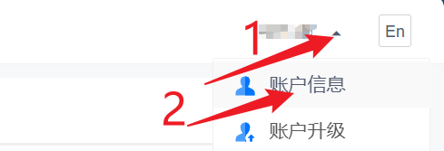
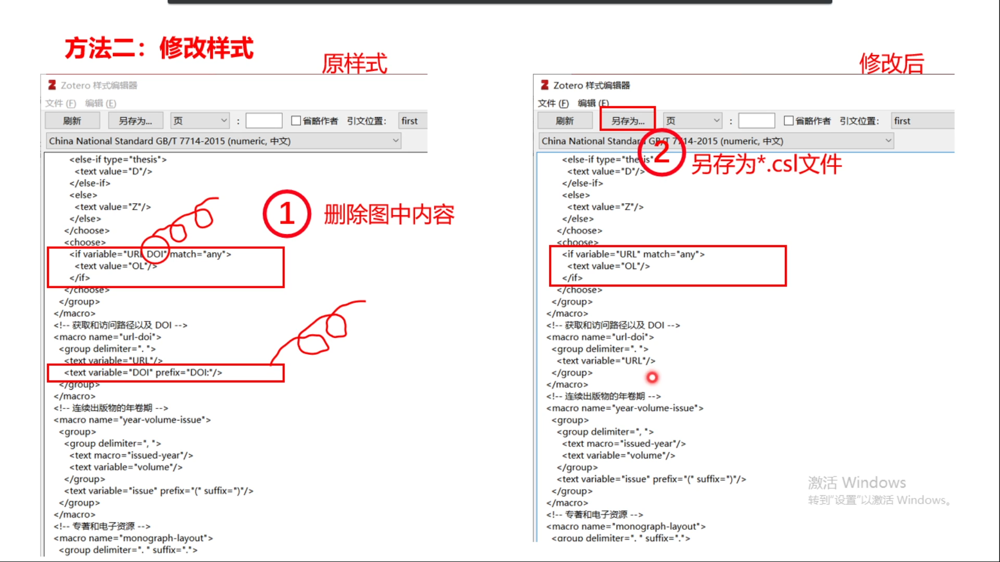

<p align="center"><strong>目录（目前还未更新完）</strong></p>  <!-- 注释:这句代码的效果为加粗居中 -->

- [一、仓库Personal-learning-notes-on-Zotero的介绍](#一仓库personal-learning-notes-on-zotero的介绍)
- [二、免责声明：](#二免责声明)
- [三、参考来源：](#三参考来源)
- [四、为什么选择Zotero、安装Zotero    ######（笔记的第一章）######](#四为什么选择zotero安装zotero----笔记的第一章)
  - [4.1 文献管理软件的优势（Zotero更加强大）](#41-文献管理软件的优势zotero更加强大)
    - [（1）使用文件夹的问题](#1使用文件夹的问题)
    - [（2）使用excel的优缺点](#2使用excel的优缺点)
    - [（3）所以使用文献管理软件](#3所以使用文献管理软件)
    - [（4）几种常用文献管理软件对比——选择Zotero](#4几种常用文献管理软件对比选择zotero)
  - [4.2 如何获取Zotero软件](#42-如何获取zotero软件)
  - [4.3 安装软件Zotero](#43-安装软件zotero)
  - [4.4 安装Zotero的插件（本次以Edge为例，视频介绍了对应谷歌插件的安装方法）](#44-安装zotero的插件本次以edge为例视频介绍了对应谷歌插件的安装方法)
- [五、收集题录](#五收集题录)
  - [5.1 在知网、外文等数据库以及网页等上使用Zotero插件收集题录](#51-在知网外文等数据库以及网页等上使用zotero插件收集题录)
    - [5.1.1 up主的操作流程](#511-up主的操作流程)
    - [5.1.2 本人的操作流程](#512-本人的操作流程)
      - [5.1.2.1 下载并安装茉莉花](#5121-下载并安装茉莉花)
      - [5.1.2.2 更改插件版本或代码，让茉莉花插件兼容。](#5122-更改插件版本或代码让茉莉花插件兼容)
      - [5.1.2.3 如果早就安装过茉莉花插件，就尝试刷新茉莉花，并更新zotero connecter(即Zotero插件)。](#5123-如果早就安装过茉莉花插件就尝试刷新茉莉花并更新zotero-connecter即zotero插件)
      - [5.1.2.4 打开浏览器的设置→cookies和网站权限→允许→添加知网的网址。](#5124-打开浏览器的设置cookies和网站权限允许添加知网的网址)
    - [5.1.2\_续 本人的操作流程](#512_续-本人的操作流程)
  - [5.2 通过标识符添加文献](#52-通过标识符添加文献)
  - [5.3 通过标识符添加文献](#53-通过标识符添加文献)
  - [5.4 从剪贴板导入](#54-从剪贴板导入)
  - [5.5 批量导入](#55-批量导入)
  - [5.6 手动添加](#56-手动添加)
  - [5.7 小结](#57-小结)
- [六、管理题录](#六管理题录)
  - [6.1 移动分类、查看包含某文献的所有文件夹](#61-移动分类查看包含某文献的所有文件夹)
  - [6.2 查重功能](#62-查重功能)
  - [6.3 关联功能](#63-关联功能)
  - [6.4 标签功能](#64-标签功能)
  - [6.5 笔记功能](#65-笔记功能)
  - [6.6 RSS订阅：自动抓取期刊文章](#66-rss订阅自动抓取期刊文章)
  - [6.7 快捷键](#67-快捷键)
  - [6.8 小结](#68-小结)
- [七、在论文中插入引文](#七在论文中插入引文)
  - [7.1 在论文中插入单个引文的上标](#71-在论文中插入单个引文的上标)
  - [7.2 在论文中插入参考文献目录](#72-在论文中插入参考文献目录)
  - [7.3 在论文中插入多个引文的上标](#73-在论文中插入多个引文的上标)
    - [7.3.1 法1：直接在检索框中操作](#731-法1直接在检索框中操作)
    - [7.3.2 法2：经典视图中选择“多重来源](#732-法2经典视图中选择多重来源)
  - [7.3 编辑引文目录](#73-编辑引文目录)
    - [7.3.1 修改已有的引文上标](#731-修改已有的引文上标)
    - [7.3.2 修改引文目录的少量小格式的方法](#732-修改引文目录的少量小格式的方法)
  - [7.5 引文样式](#75-引文样式)
    - [7.5.1 导入引文样式](#751-导入引文样式)
    - [7.5.2 更改引文样式](#752-更改引文样式)
  - [7.6 移除引文目录的域代码](#76-移除引文目录的域代码)
  - [7.7 小结](#77-小结)
- [八、同步文献](#八同步文献)
  - [8.1 Zotero服务器同步](#81-zotero服务器同步)
    - [8.1.1 同步的类型](#811-同步的类型)
    - [8.1.2 设置同步的位置](#812-设置同步的位置)
  - [8.2 文件同步：NebDAV之坚果云](#82-文件同步nebdav之坚果云)
  - [8.3 文件同步：软链接之坚果云](#83-文件同步软链接之坚果云)
  - [8.4 附件链接的同步：Onedrive+ZotFile（不具体介绍）](#84-附件链接的同步onedrivezotfile不具体介绍)
- [九、插件与常见问题](#九插件与常见问题)
  - [9.1 Jasminum(茉莉花)插件：提取中文PDF中的题录信息](#91-jasminum茉莉花插件提取中文pdf中的题录信息)
  - [9.2 PDFTranslate插件：Zotero内置阅读器的翻译插件](#92-pdftranslate插件zotero内置阅读器的翻译插件)
    - [9.2.1 PDFTranslate插件的基本使用](#921-pdftranslate插件的基本使用)
    - [9.2.2 PDFTranslate插件的翻译引擎](#922-pdftranslate插件的翻译引擎)
  - [9.3 CNKI页面批量抓取题录失败(更新编译器)](#93-cnki页面批量抓取题录失败更新编译器)
  - [9.4 文献引用目录的格式问题](#94-文献引用目录的格式问题)
  - [9.5 团队成员共享文献](#95-团队成员共享文献)
  - [9.6 小结](#96-小结)


<!-- 注释: 目前给Markdown All in One设的快捷键有，免得忘了：“Ctr+,”：生成目录;  “Ctr+；”：更新目录 -->

___  
# 一、仓库Personal-learning-notes-on-Zotero的介绍  
&emsp;&emsp;一个分享如何使用Zotero的笔记的仓库，请直接阅读README.md文件进行学习。<br> <!-- "<br>"表示换行的意思 -->

___  
# 二、免责声明：
&emsp;&emsp;笔记**仅供分享给大家学习使用，不会用作任何商业用途**，如果有人**用作非学习用途构成的侵权行为，与本人无关，请自行承担责任**。

___  
# 三、参考来源： 
&emsp;&emsp;1.该笔记是学习b站up主**浙江工商大学图书馆**分享的视频教程[**文献管理神器之Zotero**](https://www.bilibili.com/video/BV1vS4y1q7uw/?spm_id_from=333.337.search-card.all.click&vd_source=ffb19c330efad3ae5d7d43710d936b1f)，笔记来源于本人。**若有侵权，请联系本人删除**。由于本次笔记字数很多，笔误以及错别字可能很常见，若读者发现笔记有错误，欢迎批评指正。<br> <!-- "<br>"表示换行的意思 -->
&emsp;&emsp;2.其他参考链接：[**终于解决了zotero抓取中文文献的问题！！！！**](https://blog.csdn.net/hyyyyyyy499/article/details/129372982)、[**Zotero使用记录----3 茉莉花Jasminum插件的下载及功能**](https://blog.csdn.net/weixin_49818157/article/details/125261306)。  

___  
# 四、为什么选择Zotero、安装Zotero    ######（笔记的第一章）######


## 4.1 文献管理软件的优势（Zotero更加强大）
### （1）使用文件夹的问题

### （2）使用excel的优缺点

### （3）所以使用文献管理软件

### （4）几种常用文献管理软件对比——选择Zotero


## 4.2 如何获取Zotero软件
&emsp;&emsp;如图所示，点击[**Zotero的官网**](https://www.zotero.org/)，点击“Download”，再点击左侧的“Download”即可下载软件Zotero（右侧是浏览器插件）（网页加载有点慢，看动图需要耐心点）。（当然本人也将安装包扔到了仓库中。）


## 4.3 安装软件Zotero
&emsp;&emsp;首先双击安装包，然后点击Next。之后如下一堆图安装即可。（该过程b站教程没有，只有本人制作截图补充了。）


## 4.4 安装Zotero的插件（本次以Edge为例，视频介绍了对应谷歌插件的安装方法）
&emsp;&emsp;如图所示，打开Edge浏览器，点击[**Zotero的官网**](https://www.zotero.org/)，点击“Download”，再点击右侧的“Zotero Connectors for other browsers”，在“Edge connector”下面点击“Install”，点击“获取”，点击“添加扩展”即可安装Zotero的插件。

&emsp;&emsp;之后，如下图，点击Zotero插件的眼睛，让插件在上方栏里进行显示。

&emsp;&emsp;下图是谷歌上Zotero的插件的安装方法。


___  
# 五、收集题录

## 5.1 在知网、外文等数据库以及网页等上使用Zotero插件收集题录
### 5.1.1 up主的操作流程
&emsp;&emsp;如下图所示，是知网的检索界面，然后在知网的检索界面的这个页面上有很多篇文献。那么这个文献管理软件Zotero的插件会自动识别这个页面上的文献，如果说这这个页面上有多篇文献的话，它这块右上角的图标是显示为文件夹的。如果说是单篇文献的话，它会显示为个如一张纸的一个图标。

&emsp;&emsp;然后还是如上图所示，我们只要点击这个图标，那么弹出的这个对话框当中，我们可以选择我们想要搜集的文献。然后这时候就到第三步这一块，选择想要将它保存到指定的文件夹目录下面，然后这时候这些文献的题录就会保存下去。需要注意的是，因为这个软件对中文的文献不是那么友好，所以它这个中文的PDF全文像这个多篇文献的页面的话，它是没办法收集起来的。<br> <!-- "<br>"表示换行的意思 -->
&emsp;&emsp;但是像下图这种单篇文献的这个页面的话，我们直接点击这一块进行这个文献的收集的话，它会将文献的题录以及它的PDF全文直接给收集进来。<br>

&emsp;&emsp;下图是外文数据库。

&emsp;&emsp;下图是是普通的页面网页，还有些博客之类的，我们都可以将它们的题录信息进行收集。

&emsp;&emsp;收集进来以后，如下图所示，这个就是Zotero的一个主界面。它的所有的内容都在它的主界面上，在主界面的中间这一块内容就是我们刚才搜集的这些信息。

&emsp;&emsp;然后选中某一篇题录之后，在右侧的这一块，它就可以显示这个题录的详细信息，如信息、笔记、标签、关联文献。然后左边这一块，是它的目录栏，也就是说，我们可以将这些文献分类到不同的文件夹目录。对于这个目录栏，我们进行设置的时候，是可以进行无限层级的设置的。<br> <!-- "<br>"表示换行的意思 -->
&emsp;&emsp;在左下角这一块，就是它的标签栏。我们可以选择某一个标签，之后就可以将对应的标签的这些文献筛选出来。然后上方这一块是工具栏。前两个类似文件夹的图标可以添加它的文献目录、以及文库。默认，我们只有一个文库——"我的文库"。如果我们想要跟团队成员进行共享的话，我们可以创建多个文库。然后这一块的加号，就是说我们可以增加题录。然后类似放大镜的图标是高级检索的。之后上面就是一些设置。

### 5.1.2 本人的操作流程
&emsp;&emsp;（注：请在确保能使用常规方法获取各个数据库的内容后，比如通过高校的途径获取数据库后，再进行下面如本人所示的操作。）  
&emsp;&emsp;由于Zotero版本、知网等的更新，上面的方法可能会失效。于是我们按着步骤进行实际演示。第一步就出现问题了，于是本人去网上不断搜索，寻找方法。参考链接[**终于解决了zotero抓取中文文献的问题！！！！**](https://blog.csdn.net/hyyyyyyy499/article/details/129372982)和链接[**Zotero使用记录----3 茉莉花Jasminum插件的下载及功能**](https://blog.csdn.net/weixin_49818157/article/details/125261306)给出下面的方法。


####  5.1.2.1 下载并安装茉莉花
&emsp;&emsp;如下图所示，首先进入[**茉莉花插件的下载地址**](https://github.com/l0o0/jasminum/releases)，选择最新的（更正：**根据后面的操作出现的问题发现需要选择0.2.7**）版本，点击“jasminum.xpi”即可下载茉莉花插件。

&emsp;&emsp;然后如下图所示安装茉莉花插件。（发现不兼容）


####  5.1.2.2 更改插件版本或代码，让茉莉花插件兼容。
&emsp;&emsp;查了一阵在某个角落的评论区里说茉莉花插件的旧版本就可以，于是按照5.1.2.1的方法去下载**版本0.2.7**的插件，然后再按照5.1.2.1的方法安装，发现成功安装上茉莉花插件。（注：下面第二张图紧跟着5.1.2.1的倒数第二张图）（其他插件如果不兼容可能会参考参考链接[**Zotero 6.0插件不能用了？不兼容？原来原因在这**](https://www.bilibili.com/video/BV1XL4y177vE/?spm_id_from=333.337.search-card.all.click&vd_source=8ab9b0364fb2fc4f257faf0a13008080)，反正茉莉花插件参考不了。）


####  5.1.2.3 如果早就安装过茉莉花插件，就尝试刷新茉莉花，并更新zotero connecter(即Zotero插件)。
&emsp;&emsp;刷新茉莉花插件的步骤（Zotero插件更新的话，按照前面的方法重装就行）：首先，点击编辑里的首选项。

&emsp;&emsp;然后选择“茉莉花”，点击“非官方维护中文翻译器”，点击“更新全部”，等待更新完毕后点击“OK”。

&emsp;&emsp;之后，如下图所示更新浏览器翻译器的信息。右键Zotero插件，然后点击“扩展选项”。点击“Advanced”，之后点击更新翻译器“Update Translators”即可。


####  5.1.2.4 打开浏览器的设置→cookies和网站权限→允许→添加知网的网址。
&emsp;&emsp;步骤如下几张图所示。（注：知网链接为“https://www.cnki.net”）


&emsp;&emsp;（注：上一张图鼠标滚动了下才看到提示，然后才截的图。）

### 5.1.2_续 本人的操作流程
&emsp;&emsp;注：经过上面的操作后，请重启浏览器，然后直接进入知网检索页面（`“https://kns.cnki.net/kns8/defaultresult/index”`），这样在知网搜索后Zotero插件才会显示为黄色文件夹。如果进入知网官网后再进入检索页面，发现Zotero没有变成黄色文件夹，此时Zotero插件无法批量捕获知网的pdf文件。下面两张动图给出了对比。
<!-- 注释: 下面的两个div块插入了两张居中的图 -->
<div align="center">
  
  <p><em>直接进入检索可正常使用Zotero插件的示意图</em></p>
</div>
<div align="center">
  
  <p><em>如果进入知网官网再进入检索页面，发现Zotero没有变成黄色文件夹</em></p>
</div>

&emsp;&emsp;接着，我们重新进入知网上检索页面检索一下需要的内容。发现插件Zotero已经变成黄色的文件夹，此时可以如下图所示将知网上的多个文献收集到软件Zotero中。(为了节省学校的资源，本人只选了三个。)

&emsp;&emsp;再同样的方式收集英文数据库的文献。


&emsp;&emsp;之后到Zotero查看，发现文献的pdf等都收集到Zotero里面了。


## 5.2 通过标识符添加文献
&emsp;&emsp;第二种添加题录的方法是通过标识符添加的。这里的标识符，指的是可以根据图书的ISBN编号、DOI号、PubMed数据库的PMID、arXiv数据库的ID或者ADS条码号。

&emsp;&emsp;如上图所示，它给出了使用DOI号添加题录的示意图。在我们我们直接输入DOI号，一般它就可以将这篇文献的题录提取出来，加入到我们的这个文库里面。如果加入进来的只有它的题录信息，没有PDF全文的话，那么我们可以点击右键，然后点击“找到可用的PDF”来获取它的全文信息。

## 5.3 通过标识符添加文献

&emsp;&emsp;第三种方法，就是在我们已经下载了PDF文献之后使用的。我们只要将PDF文献直接拖拽到软件Zotero的空白处。

&emsp;&emsp;那么在这个空白页面呢，如上图所示，Zotero就可以自动将这篇文献的题录信息直接进行提取。


## 5.4 从剪贴板导入
&emsp;&emsp;第四种方法就是从剪贴板导入。

&emsp;&emsp;先按照上图的操作得到下图的页面。假如我们需要将知网的这篇文献导出到参考文献。于是选择格式Refworks，然后再将参考文献复制到剪贴板。

&emsp;&emsp;然后再回到这个软件Zotero里面，点击"文件"、“从剪贴板导入”（或者使用快捷键CTRL+shift+alt+i实现“从剪贴板导入文献”的功能）。通过这种方式导入的话，它只添加了题录信息，而没有添加PDF全文。那么我们可以通过添加附件或者是通过右键找到可用的PDF来添加它的PDF全文信息。


## 5.5 批量导入
&emsp;&emsp;第五种方式，批量导入。对于批量导入，我们可以在某一个数据库里面，选择多篇文献，然后将它们导出到参考文献里面。当文献选择完成之后，我们可以选择格式Refworks，然后再将它们导出。


&emsp;&emsp;这时候导出的是多篇文献的信息，然后在软件Zotero里面的文件导入这一块将多篇文件进行导入。导入的时候需要注意的是，图中右边的文件类型需要选择我们前面对应的Refworks。然后再将刚才下载下来的这个txt文档进行导入.

&emsp;&emsp;下一步，首先可以勾选"将导入的集合和项目放入新集合中"。然后这时候，在Zotero主页面这一块就多了一个新的文件夹，这个就是刚才导入的这些文献。
&emsp;&emsp;假如我们不想要将这些文献放在这个新文件夹中。我们可以通过“对准该文件（或文件夹）按住shift键+鼠标左键”的方式，直接将这些文献拖动到我们想要将它放置在某个文件夹目录中就可以了。


## 5.6 手动添加
&emsp;&emsp;最后一种添加方式，手动添加。手动添加的话，一般来说不建议采用.这种方式，我们可以在这一块点击加号，然后选择要添加的文献类型。（或者是通过文件选择新建条目，选择要添加的文献类型。）

&emsp;&emsp;然后这时候右侧这一块就多了一个空的条目。然后我们将题录信息进行补全就可以了。

## 5.7 小结

&emsp;&emsp;我们来总结一下，刚才说的这些收集题录的功能呢，可以通过浏览器插件，这种方式比较推荐，使用起来比较方便，用途也较广一点。<br>
&emsp;&emsp;对于第二种方式，通过标识符收集题录。当网页速度可能比较慢。然后我们知道它的DOI的时候，此时我们可以通过这种方式进行添加。<br>
&emsp;&emsp;至于第三种方式，就是说当我们有PDF文件的时候，那么我们就可以直接拖拽进去。<br>
&emsp;&emsp;然后还可以通过剪贴版导入或者是批量导入。批量导入的话，我们是可以在数据库上直接检索多篇文献。但是，其实数据库上检索多篇文献，我们也可以通过浏览器插件直接导入。那么对于从其他的文献管理软件进行导入的话，我们可以选择这个批量导入。<br>
&emsp;&emsp;好，最后一种是手动添加。

# 六、管理题录
&emsp;&emsp;接下来我们来看一下对题录进行管理。


## 6.1 移动分类、查看包含某文献的所有文件夹
&emsp;&emsp;法1：对于有些题录呢，我们就是将它们放在某个文件夹目录下面。这些目录其实也起到一个分类的作用。但有时候我们不想将它放在这个目录下面。前面我们也提到过，我们可以“按住shift+鼠标左键”，直接将这篇文献拖动到其他文件目录下面。<br>

&emsp;&emsp;那么如果我们不按shift，直接是鼠标左键拖动的话，它其实相当于是在另一个文件夹目录下面**复制**了这篇文献的题录信息。<br>
&emsp;&emsp;法2：其实我们也可以通过点击右键，然后选择“添加到分类”，或者是“从分类中移除条目”，通过这种方式，然后将它添加到某一个文件夹目录下面。<br>

&emsp;&emsp;然后对于一篇文献，我们如果想要知道它在哪些文件夹目录下面的话，我们可以先选中该文献,然后按住Ctr键。这时候，在文件夹目录这一块就会高亮显示这篇文献所对应的这个分组目录。<br>

## 6.2 查重功能
&emsp;&emsp;第二个功能就是查重功能。当我们导入了多篇的文献，有时候可能有一些重复的文献导入进来了。这时候如下图所示,我们就可以直接在左侧点击“重复条目”，就可以将重复的文献信息给筛选出来。<br>

&emsp;&emsp;如果“重复条目”没有显示的话，我们可以在“我的文库”处右键，选择“显示重复条目”，之后“重复条目”就显示出来了。<br>
&emsp;&emsp;显示出来以后，每选中一篇文献，它其实每次选中都是该篇文章的所有题录（注：这里本人发现跟视频描述有略微区别，有所改动），在选中以后我们可以进行合并。<br>

## 6.3 关联功能
&emsp;&emsp;第三个功能就是关联功能。什么是关联功能？就是我们可以将某一篇文献跟其他文献进行关联，就比如说是不同版本的文献，或者是同一本书的不同章节或者同一个项目的不同文献之间，我们可以建立一些关联。<br>

&emsp;&emsp;如上图所示，比如说在这篇文献下面，我们在关联文献这一块点击“添加”，然后添加其他文献。那么这时候这篇文献跟另一篇文献之间就建立了关联，它的关联之间是**双向的**，如下图所示。假设我们将文献A与文献B进行关联，点击文献A，我们可以在关联文献中看到文献B；点击文献B，我们可以在关联文献中看到文献A。<br>

&emsp;&emsp;但是关联并**不传递**。比如，如果文献A关联到B,文献B关联到文献C，那么文献A是不会关联到文献C的。<br>

## 6.4 标签功能
&emsp;&emsp;第四个功能，标签功能。<br>

&emsp;&emsp;如上图所示，对于标签功能的使用，就是选中某一篇文献，我们直接在标签这一块，点击"Add"就可以添加标签，然后下面的减号“-”就可以将它的某些标签给删除掉。之后添加后的标签呢，它会显示在左下角这一块，在左下角的这个标签，我们可以对它们指派颜色。就是说我们可以设置这个标签为不同的颜色。<br>

&emsp;&emsp;如上图所示，这时候我们选中某一条标签，那么中间这一块的文献就会显示出来这个标签下面的这些文献。然后在这些文献的前面，它就会将有颜色的这些标签的对应所有颜色给它显示出来。<br>
&emsp;&emsp;我们在设置一些重要文献的时候，可以给这些文献设置好标签。然后这些文献就可以一目了然地一下子就可以被找到。<br>

&emsp;&emsp;对于我们导入的文献，或者说是通过浏览器插件收集的这些文献。那么它们的标签会根据它们的关键词、标题自动给文献添加标签。如果我们不想让Zotero自动添加标签的话，我们可以在Zotero"编辑-首选项-常规"这一块将这个选项(即“基于关键词和主题词自动为条目添加标签”)给勾选掉。<br>
&emsp;&emsp;嗯，需要注意的是，Zotero这个软件，它的很多设置可以说都是在“编辑-首选项”这个页面进行设置的。接下来我们要讲的像同步功能呀，还有它的一些引用、高级文件夹这些都是在“编辑-首选项”这一块进行设置就可以了。<br>

## 6.5 笔记功能
&emsp;&emsp;接着是它的笔记功能。对于Zotero当中的笔记，它具体分为三类笔记。<br>
&emsp;&emsp;第一类就是PDF附件或者是其他类型的附件，它会自带一个笔记，如下图所示。在右侧的这一块，我们可以添加笔记。第二类笔记，就是它的独立的条目笔记。第三类笔记就是注释笔记。<br>

&emsp;&emsp;我们先来看一下**注释笔记**。如下图所示，软件Zotero内置了一个PDF阅读器。我们可以将它的PDF全文用这个PDF阅读器打开。打开以后，我们可以在上面做一些注释，比如高亮文本、或者是添加笔记（就是说添加某一段内容的一个评论，或者是选择区域。选择区域的话，就是我们可以选择某一块图片或者表格。那么这些注释内容就会在左侧的这一块的注释栏进行显示。）。然后像左下角这一块笔记的话，它就是一个图片，我们可以将它加入到注释里面。<br>

&emsp;&emsp;那么对于这些高亮文本以及评论呀，还有类似这些图片的区域这种注释，我们可以对它们设置某一种颜色，也可以对它们添加标签。那么对于这些注释内容，我们可以通过它们的标签或者是它们注释的颜色，从而进行筛选。<br>
&emsp;&emsp;然后右侧这一块呢，如上图所示，我们可以点击用圈圈出来的这个东西，这一块添加条目（下图中的加号），选择添加“通过注释添加条目笔记”。这样，就可以将这些注释内容添加到一条独立的笔记里面。<br>

&emsp;&emsp;如下图所示，添加完成的笔记，它会在“注释”这一块存储注释笔记。<br>

&emsp;&emsp;然后对于它的注释笔记，还有它的条目笔记呢，我们可以将它们进行导出。导出的话，可以导出为Markdown格式的笔记。然后这个笔记呢，我们可以在其他的管理软件当中进行管理。像下图这个就是导出的笔记，然后在笔记管理软件Obsidian里面进行打开的效果。<br>

&emsp;&emsp;然后在Obsidian这个软件当中，我们可以看到有它的超链接。点击超链接以后，它就会自动跳转到Zotero的条目的注释的那一块。<br>

&emsp;&emsp;当然我们不一定通过这种方式将它导出笔记，这也比较麻烦。我们可以直接将Zotero跟这个笔记管理软件Obsidian打开，然后直接按住Shift键，然后将这个注释笔记直接给拖过去，然后就可以在这个笔记管理软件Obsidian里面看到，也可以直接点击超链接，就跳转到这个文库的这个条目的对应位置。当然，也可以点击高亮文本，也能跳转。<br>

## 6.6 RSS订阅：自动抓取期刊文章
&emsp;&emsp;第六个功能，RSS订阅。我们有时候就是要追踪某些期刊文章。那我们通常的做法呢，就是说去网页上，然后就是实时地去刷新检索，然后去看这本期刊有没有新的文献，有没有收录进来。<br>
&emsp;&emsp;其实可以通过软件Zotero，我们可以追踪期刊，具体的做法呢。如下图所示，点击“新建订阅”、“来自URL...”。 <br>


&emsp;&emsp;然后如下图所示，输入URL地址，设定更新的时间间隔。<br>

&emsp;&emsp;那么这个URL地址呢，我们可以在每一本期刊的数据库页面可以找到。比如说像下图的这本期刊，我们在知网上找到这本期刊的期刊页面。然后在右上角这一块我们点击“RSS订阅”，就可以获得这本期刊的RSS订阅的网址。然后我们将这个网址放在上图的这个URL地址里面，然后就可以设置成功。<br>

&emsp;&emsp;下图就是它自动抓取的这个效果。<br>


## 6.7 快捷键

&emsp;&emsp;第七个功能，快捷键。刚才有提到这两个快捷键，“鼠标左键拖动”和“Shift+鼠标左键拖动”。<br>
&emsp;&emsp;（1）“鼠标左键直接拖动”文献到另一个文件目录下面的话，就相当于是**复制文献**。<br>
&emsp;&emsp;（2）“按住shift键+鼠标左键进行拖动”的话，它是直接将文献**移动**到另一个文件目录中。<br>
&emsp;&emsp;（3）然后选中某一篇文献，按**Ctr键**的话，就可以高亮显示这篇文献所在的分组目录。<br>
&emsp;&emsp;（3）“CTRL+Shift+Alt+I”就是从剪贴板导入题录。<br>
&emsp;&emsp;(4)快捷键“Ctr+T”,它可以**切换显示翻译前后的标题**，这个在后面的PDFTranslate这个插件里面会讲到。<br>
&emsp;&emsp;(5)加号“+”，可以展开所有的目录。<br>
&emsp;&emsp;(6)减号“-”，可以折叠所有的目录。<br>
&emsp;&emsp;这些快捷键，大家在用的时候，到时候再对照着去看就可以了。<br>

## 6.8 小结

&emsp;&emsp;管理题录这一块主要的功能就是（1）移动分类、（2）对重复的文献进行查重、（3）对不同版本的文献或者同一本书的不同章节，以及同一项目的不同文献，我们可以进行关联文献、（4）还可以设置标签。标签，可以指派颜色。<br>
&emsp;&emsp;（5）笔记。笔记的话，特别是需要注意的是注释笔记，就是它内置PDF阅读器，我们可以将PDF当中的注释导出为笔记。<br>
&emsp;&emsp;（6）然后RSS订阅的话，可以追踪某一本期刊的发文情况。<br>
&emsp;&emsp;（7）还有就是快捷键。<br>

# 七、在论文中插入引文
&emsp;&emsp;我们再接着进入第四部分，就是在论文中插入引文。<br>

## 7.1 在论文中插入单个引文的上标
&emsp;&emsp;当我们安装完Zotero这个软件以后，一般来说在我们的Office Word里面，它会自动安装这个Zotero的word插件，然后安装完成以后，这边是会显示Zotero的。<br>

&emsp;&emsp;如上图所示，我们添加引文的话，就只需要先将光标放置在要插入的引文处，选择插件Zotero，然后点击添加引文（即“Add/Edit Citation”）这个按钮。接着如下图所示，选择添加的引文样式，一般来说我们要添加的中文文献的引文样式的为“China National Standard GB/T 7714-2015 (numeric,中文)”。<br>

&emsp;&emsp;这个样式选择好以后，然后点击“OK”。如下图所示，这时候会出现一个检索框，在检索框当中输入我们想要插入的这个引文的标题，然后在检索出来以后，点击需要引用的文献就可以了。<br>

&emsp;&emsp;或者我们可以通过这一块的经典视图，然后打开这个对话框，在对话框当中选择我们所需要添加的这一篇文献的引文，然后点击“OK”。<br>

&emsp;&emsp;这时候在刚才的这个光标这一块，它的右上角就多了一个中括号“[1]”,这一块就表示它的引文添加成功。<br>

## 7.2 在论文中插入参考文献目录
&emsp;&emsp;但引文添加成功以后，它的下方的这个参考文献目录是没有的。我们需要将光标放置在下方这一块，然后再点击的添加引文目录（即“Add/Edit Bibliography”），然后就将参考文献目录添加进来了。<br>


## 7.3 在论文中插入多个引文的上标
&emsp;&emsp;前面讲的是在某一个位置添加单篇的引文。而有时候，我们可能需要在某一个位置添加多篇文献的引文。<br>
### 7.3.1 法1：直接在检索框中操作
&emsp;&emsp;那么这时候与前面的操作都一样，在检索框这一块呢，我们可以检索多篇文献，然后选择多篇文献。<br>

### 7.3.2 法2：经典视图中选择“多重来源
&emsp;&emsp;或者呢，我们在经典视图这一块，然后选择多重来源，然后在右侧这一块选择要插入的多篇文献。这时候就添加完成了，它就可以同时将多篇文献添加进来。<br>


&emsp;&emsp;那么对于这个多篇文献，它默认是用逗号隔开的。而有些期刊它会要求这里不能用逗号，必须要用短杠“-”，那么我们也可以直接对它进行修改。<br>

&emsp;&emsp;修改完以后，再保存的话，它会自动弹出这个对话框式，想要保留这个修改吗？我们点击“是”。接下来我们点击“Zotero-Refresh”进行这个引文的更新。点完这个刷新按钮的话，短杠“-”就会直接保留下来。不像有一些文献管理软件，它是不会保留我们修改的这种格式的。<br>

## 7.3 编辑引文目录
### 7.3.1 修改已有的引文上标

&emsp;&emsp;那么对于添加的引文，我们如果说想要将刚才添加的这个引文换一篇文献的话，那么我们可以直接选中刚才添加过的这个引文的位置，然后点击添加或编辑引文（即“Add/Edit Citation”），我们再重新选择引文就可以了。 <br>

### 7.3.2 修改引文目录的少量小格式的方法

&emsp;&emsp;好，对于一些引文目录，我们有一些可能有小细节或者一些格式要进行调整。那么我们可以直接进行调整。直接调整的话，通常点击这个刷新“Refresh”按钮的话，它这一块会相当于会将你的修改进行覆盖掉，然后又回到原始的这个格式。 <br>

&emsp;&emsp;如上图，我们也可以在这一块（即“Add/Edit Bibliography”）进行修改。但是这种方式呢，它也不能保留它的更新。那么像这种方式只是说对于一些小细节，我们可以通过这种方式进行修改。 <br>
&emsp;&emsp;然后对于想要保留下来的格式进行修改呢，这个在接下来的话，我们等一会儿会介绍到。<br>

## 7.5 引文样式
### 7.5.1 导入引文样式
&emsp;&emsp;Zotero这个软件呢，它内置有一千多种样式。但对于我们平常比较经常用到的中文样式,像“China National Standard GB/T 7714-2015 (numeric,中文)”这种格式呢，它这一块是没有的。<br>

&emsp;&emsp;那么我们可以进入这个软件的“编辑-首选项-引用”这一块，然后点击这一块的加号“+”，将我们需要的这种样式给导入进来。<br>
&emsp;&emsp;注：以下过程可以通过“获取更多样式...”、搜索对应的样式并选择即可完成。
&emsp;&emsp;在导入之前我们就需要先进行下载，下载的话，我们可以到这个网址("https://editor.citationstyles.org/about/")上去检索对应的这个引文样式，然后对它进行安装导出，导出为“.csl”文件格式，然后再到Zotero的“编辑-首选项-引用”里面将它导入就可以了。<br>
&emsp;&emsp;如下图所示，导入以后,进行查看的话，它的样式格式是这种格式的。<br>

### 7.5.2 更改引文样式
&emsp;&emsp;如图所示，假设我们要投稿不同的期刊，那么不同的期刊，它的样式要求是不一样的。我们可以直接通过这一块的文档设置（“即Zotero-Document Preferences”），然后重新选择一个样式。那么下方的这一块显示的样式就可以进行一键更改。<br>


## 7.6 移除引文目录的域代码

&emsp;&emsp;我们在投稿的时候，有些期刊可能会要求文档不能保留有域代码这些信息的，比如我们通过Zotero软件进行插入引文的话，这个word文档跟Zotero软件之间，它是有一些代码信息的。如果想要将这些代码信息给去除掉的话。我们们可以**点击“Unlink Citations”**的，然后将域代码格式给去除掉，只保留文本的信息。<br>

## 7.7 小结

&emsp;&emsp;这一块内容讲的主要是怎么添加引文、在同一个位置添加多篇引文。然后如果想要更改我们添加的这个引文，我们可以对它进行编辑。然后编辑引文目录呢，一般是在小细节修改的时候可以用到。然后还可以导入新的引文样式，对引文样式进行更改，或者是我们文档当中的引文样式，一键进行修改。还有移除域代码，只保留它的文本信息。<br>

# 八、同步文献

&emsp;&emsp;前面主要讲的就是Zotero的大概的功能，接下来我们来讲一下它的文献同步功能。<br>

## 8.1 Zotero服务器同步
### 8.1.1 同步的类型
&emsp;&emsp;Zotero的文献同步呢，它与一般的软件是不一样的，很多软件的数据跟文件附件是一块进行同步的。软件Zotero的同步功能分成两部分，就**数据同步跟文件同步是分别**进行设置的。<br>

&emsp;&emsp;它的数据，主要是指条目、标签、笔记、链接等。数据同步是免费的、不限流量的，我们可以直接使用Zotero服务器进行同步就可以了。<br>
&emsp;&emsp;文件，主要是指文件附件，像PDF文件等。但是文件同步是300M以内是免费的，超出就是要收费的。<br>
### 8.1.2 设置同步的位置

&emsp;&emsp;至于在哪个位置设置同步功能？找到“**编辑-首选项-同步**”的位置，就可以进行数据同步和文件同步的设置。我们一般使用软件，就是能免费就尽量免费。所以数据同步，我们就使用Zotero自带的数据同步。而文件同步，Zotero还提供了，就是WebDAV协议，就是我们可以通过这种协议，不使用它的Zotero服务器进行文件同步。<br>

## 8.2 文件同步：NebDAV之坚果云

&emsp;&emsp;国内的同步盘支持WebDAV协议的只有一个网盘——**坚果云**。所以接下来我们需要注册Zotero的个人账号；安装坚果云，注册个人账号。（注：坚果云安装的时候，有一些Win10系统的小伙伴可能会有提示，“需要安装点.NET Framework 3.5”。这时候我们可以自己去看一下这个链接"https://jingyan.baidu.com/article/7c6fb428169a2ec1652c903d.html"。）<br>
&emsp;&emsp;如下图所示，我们需要打开坚果云的个人界面，然后在“账户信息”的“安全选项”这一块，我们可以点击“添加应用”，名称输入“Zotero”,选择“生成密码”。<br>



&emsp;&emsp;之后，复制密码。<br>

&emsp;&emsp;然后，如下图所示，回到Zotero的“编辑-首选项-同步”的页面。数据同步，我们就使用它的Zotero服务器的个人账号进行同步就可以了。文件同步这一块，我们不选择Zotero，我们选择这个WebDAV，再输入URL地址、用户名、密码。之后，再点击“验证服务器”，再根据提示操作即可。然后再点击“OK”。这时候它的数据同步以及它的文件同步就已经设置好了。<br>

&emsp;&emsp;然后这一块的文件同步呢，它在坚果云软件里面，它是将PDF文件这些内容，它是对它们进行重新压缩的。那么有些同学可能会觉得说，我坚果云软件也不想要。嗯，这样子压缩，我想要它显示PDF全文。那么其实这个是完全不影响的。我们在不同的终端，就是在不同的电脑上操作的话，因为我们都安装了Zotero。那么它的PDF文件打开的话，也是整个的PDF内容，只不过是在它的坚果云这个同步盘上，它是对它们进行了重新压缩的。如果我们不想要通过这种方式呢？那么还有一种方式就是可以通过软链接的方式。<br>

## 8.3 文件同步：软链接之坚果云

&emsp;&emsp;前面的操作都是一样的，都是注册Zotero的个人账号、安装坚果云以及注册它的账号。<br>
&emsp;&emsp;好，接下来这一步呢我们只设置它的数据同步，文件同步这一块我们不进行勾选。<br>

&emsp;&emsp;如上图，接下来我们再通过软链接进行文件同步。对于Zotero软件的话，它在它的安装目录下面，比如说我将Zotero它的文件放置在"D盘的storage"这个文件夹下。这个文件夹下呢，它会有这么几个文件夹：一个是storage，负责存放Zotero的文件附件；文件夹styles负责存放它的引文样式；文件夹translators负责存放它的编辑器的。<br>

&emsp;&emsp;那么第1小步，我们可以将storage的整个文件夹，然后将它剪切到坚果云在本地的一个文件夹下面（图中“D:Jianguoyun\zotero\storage”）。<br>
&emsp;&emsp;第2小步，使用快捷键Win+R、输入“cmd”打开Windows控制台命令窗口。再执行命令“mklink /j "D:\Zotero\storage"”创建坚果云的软链接。执行该命令行，文件夹“storage”会出现类似文件夹快捷方式的图标，其实它与文件夹快捷方式是不一样的。这个文件夹打开以后，它是空的。它的内容就是通过软链接的方式全部存放在这个坚果云下面的。<br>
```python
mklink /j "D:\Zotero\storage"  # 创建坚果云的软链接
```
&emsp;&emsp;我们在Zotero的这个storage（即“D:\Zotero\storage”）这个文件夹做的一切的修改，它其实都是对文件夹“D:Jianguoyun\zotero\storage”进行的修改。那么我们对这个坚果云这个文件夹（即“D:Jianguoyun\zotero\storage”）进行同步的话，也就相当于对它这个storage（即“D:\Zotero\storage”）进行了同步，也就是对Zotero下的文件附件进行了同步。<br>
&emsp;&emsp;这种方式，只是对相同的操作系统进行同步的话，会起作用。不同的操作系统的话就不太起作用。所以推荐大家使用的呢还是通过这个WebDAV坚果云的这种方式进行同步。这种方式同步的话，我们可以在不同的操作系统之间实现文献的同步。<br>

&emsp;&emsp;那么坚果云的免费版，它的上传流量是1G/月，下载流量是3G/月，空间受限于上传流量，也就是每个月是1G的流量。对于我们一般使用文献来说，每个月1G的流量其实是足够了的。<br>

## 8.4 附件链接的同步：Onedrive+ZotFile（不具体介绍）
&emsp;&emsp;还有一种方式,附件链接同步的方式。这个还需要用到一个同步盘Onedrive,加一个插件搜集file。感兴趣的同学可以自己回去研究一下。<br>

# 九、插件与常见问题
&emsp;&emsp;第六部分，我们就来讲一下Zotero的插件以及我们在使用这个软件的时候会碰到的一些常见的问题。前面也提到过这个软件（即Zotero），它是免费的，并且它是开源的。开源的话就意味着它拥有很多很多的插件，然后这些插件也都是免费的。那么今天我们就介绍两个比较常用的插件，一款叫茉莉花插件，一款是翻译插件PDFTranslate的插件。<br>

## 9.1 Jasminum(茉莉花)插件：提取中文PDF中的题录信息
&emsp;&emsp;在Zotero这个软件当中，我们可以将PDF文件直接拖拽进来。那么这个软件它会自动识别它的文件，然后提示它的提题录。但是对于中文的PDF文件，直接拖拽过来呢，它其实是无法直接识别的。这时候我们就可以通过这个茉莉花插件进行解决。<br>

&emsp;&emsp;茉莉花插件插件呢，我们可以到这个[网址(可点击该链接)](https://github.com/l0o0/jasminum)去下载，就在这个页面的右上角有它的各个发布。我们找到最新的一个发布信息，然后将它下载下来。<br>

&emsp;&emsp;如下图，下载下来以后，再到软件Zotero的“工具-插件”，打开以后就是下图这个页面。然后我们将下载下来的这个“.xpi”文件直接拖拽到这个插件管理页面上面，之后插件就安装成功了。然后再重启一下Zotero就可以了。<br>

&emsp;&emsp;这时候，在这个PDF文件上面点击右键，它会出现一个知网助手，然后点击这个“抓取知网元数据”。那么我们就可以提取它的PDF文件当中的文献信息。<br>

&emsp;&emsp;这个（下图）就是已提取好的信息。那么Zotero里面,它的作者呢,它的姓与名是分开的。所以这个插件呢，它还实现了可以对它文献题录信息进行拆分姓名或者合并姓名的这个功能。<br>


## 9.2 PDFTranslate插件：Zotero内置阅读器的翻译插件
### 9.2.1 PDFTranslate插件的基本使用
&emsp;&emsp;第二个插件呢，就是PDFTranslate插件。这个插件在使用当中，经常看外文文献的小伙伴可能会用得比较多一点。我们在Zotero的这个主页面上面选择这些外文文献或者是全部选择文献也可以。然后我们右键，点击“标题翻译”，这时候它就可以对它的外文文献的标题进行翻译。翻译完成以后，我们可以按住这个快捷键“**Ctr+T**”切换显示翻译前后的标题（注：插件安装的话，就跟前面的茉莉花插件得安装步骤是一样的。）<br>

&emsp;&emsp;如下图，这个是打开PDF文件以后进入它的内置的PDF阅读器。然后在这个内置的PDF阅读器中，我们前面讲到是右上角这一块呢，可以将它的注释导出为笔记。然后我们点击这一块（即下图通过圆圈圈出来的位置），然后点击“Translate”，之后选中需要翻译的地方，插件PDFTranslate就会自动进行翻译。<br>

&emsp;&emsp;对于翻译的API，我们可以选择谷歌翻译或者是百度翻译啊，或者有道翻译。然后这个语言也可以进行设置，是从英文到汉语，或者是其他语言之间进行翻译。如果说我们选择的不是这种长文本，而选择的是某一个单词的话，那么它出现的就是相当于词典的功能。<br>
&emsp;&emsp;那么对于某一段内容或者是某一个单词，我们将它选择以后进行**高亮**。那么高亮以后，它会加入到左侧这一块的**注释栏**。对于在注释栏里的内容，我们在安装了这个插件以后，它会自动对注释的内容进行翻译，然后自动加入到这个注释栏里面。<br>
### 9.2.2 PDFTranslate插件的翻译引擎

&emsp;&emsp;好，如上图，在Zotero的“编辑-首选项-Translate”的这里，它默认的翻译引擎是谷歌翻译。我们可以在这一块设置它默认的翻译引擎以及它默认的翻译语言。<br>、

## 9.3 CNKI页面批量抓取题录失败(更新编译器)
&emsp;&emsp;接下来我们再讲一下，就是使用这个软件的时候会碰到的一些问题。有些同学可能会说在知网的那个页面进行批量抓取题录的时候，有时候会出现失败。那么这个呢，一般是因为这个编译器**没有及时更新**。一般情况下，我们是不需要进行更新的。那么有时候会出现一些问题，可能出现编译器过时的情况。那么这时候我们就可以自己去更新一下这个编译器。<br>

&emsp;&emsp;具体的操作方法，如上图所示，就是打开Zotero的"编辑-首选项-高级"这一块，我们看一下我们的**数据存放位置**在哪？默认情况下，我们的数据是存放在“C盘-我的文库的Zotero”（即“C:\Users\LINGYE\Zotero”）这个文件夹下面。但C盘的话，一般情况下是不建议大家存放的。就是说，如果我们碰到断电的情况，那么C盘的内容有可能会丢失掉，建议大家是将它放到C盘以外的其他的非系统盘里面。<br>
&emsp;&emsp;然后如下图这一块是存放在“E盘的Zotero”里面。然后我们再到文件夹Zotero下面的文件夹translators里面，这个文件夹放的就是它的翻译编辑器。这些编辑器主要用于网页上的浏览器插件进行抓取题录用的。我们现在是要对它们进行**更新**。那么再到这个网址[**github仓库translators_CN**](https://github.com/l0o0/translators_CN)，然后去找到这个"CNKI.js"将它下载下来，然后再将文件夹里的这个编辑器替换掉。<br>

&emsp;&emsp;之后，如下图右击在浏览器中的Zotero插件，点击“选项”，然后在"Advanced"下面，再将它们的编辑器进行更新（即“Update Translators”），再重启下浏览器。一般来说这种方式就可以解决我们前面提到的这个问题。<br>


## 9.4 文献引用目录的格式问题
&emsp;&emsp;还有一个问题，就是大家在word文档写论文的时候，插入引文，然后有时候会发现插入的引文格式不是我们所需要的这种引文格式。就比如说像下图的参考文献目录的[2]，我选择的是“China National Standard GB/T 7714-2015 (numeric,中文)”这个中文常用的这种引文格式。那么它这一块插入这个英文文献的时候，它这里是“[J/OL]”,就不像中文文献，直接是"[J]"。一般的期刊，它要求的是“[J]”，没有要求这个"OL",还有这里也将DOI信息给加入了进来，这些信息其实也是不需要的。<br>

&emsp;&emsp;那么我们也可以直接在word文档上进行修改。但**修改后一刷新这一块内容又会直接变成这个样子**。所以碰到这种情况呢，我们还是需要先去看一下它的样式。我们可以到Zotero的"编辑-首选项-引用"这一块，然后选中样式“China National Standard GB/T 7714-2015 (numeric,中文)”，点击“样式编辑器”。<br>


&emsp;&emsp;如上图，我们去看一下里面的样式编辑器的信息，其实这一块的信息的话，它都是按照XML格式进行编写的。然后我们找到这个文献类型标识可以看到：如果文献是期刊文献的话，那么对应的文献标识为“J”。<br>
```XML
<!-- 
- 含义：如果文献是期刊文献的话，那么对应的文献标识为“J”。
- 对应代码为：
-->
</if>
<else-if type="article-journal article-magazine periodical" match="any">
  <text value="J"/>
```
&emsp;&emsp;那么在这个页面的下方的话，可以看到，如果出现“URL DOI”的话，那么“test value”等于“OL”。前面的话，我们说的文献[2]是多了一个"OL",那么我们就可以猜测，是因为有了"URL"以及DOI这些信息，然后导致这个文献样式里面多了这个"OL"。<br>
```XML
<!-- 
- 含义：当题录中有URL或DOI时，会自动加上OL。
- 对应代码为： 
-->
<if variable="URL DOI" match="any">
  <text value="OL"/>
</if>
```
&emsp;&emsp;那么我们再看下面这一块，然后它是如果是“test variable="DOI"”，那么它的前缀就是"DOI:"，这个"DOI:"就跟前面显示的DOI号是一样的。<br>
```XML
<!-- 
- 含义:当题录中有DOI时，引文中会有DOI
- 对应代码为： 
-->
  <text variable="DOI" prefix="DOI:"/>
```
&emsp;&emsp;至于**如何处理这些问题**？**方法1**:我们可以将题录当中的“UIL”或者“DOI”删除掉就可以解决。但是DOI的话，它是一篇文献的唯一标识符。有时候在自动抓取PDF全文的时候，这个软件(即Zotero)它其实是会用到DOI的。所以对于DOI信息，我们不想将它给删除掉。<br>
&emsp;&emsp;**方法2**:我们可以**对样式进行修改**，它不是出现“URL”或“DOI”才会将这些信息加入进去吗？如下图，那么我们就将这些信息给删除掉，删除掉以后，如图的右边，这个就是删除掉以后的信息，然后再将这个样式另存为“.csl”文件格式。<br>

&emsp;&emsp;然后另存为“.csl”文件格式以后，我们再到“编辑-首选项-高级-文件和文件夹”中看一下我们的文件目录是在哪个目录下面，然后找到这个文件目录，在下面的文件夹“styles”（就是它的引文样式的文件夹）。然后再将这里面的这个“.csl”文件给替换掉。之后重启Zotero以及重新打开word，再重新刷新一下引文，那么这个问题就可以解决掉。<br>


## 9.5 团队成员共享文献
&emsp;&emsp;好，最后一个问题，就是说我们团队成员之间怎么样来共享文献？在这个软件呢，它默认只有一个我的文库。那么如果我们想要共享的话，如下图，我们可以再新建一个群组，然后这时候它会跳转到这个网页上。然后我们在网页上可以创建一个群组名称，然后可以选择是私人群组还是公开的群组，然后点击创建。创建成功以后，在图的左侧这一块就多了一个群组。然后对于这个群组，我们可以设置群组成员，群组成员之间是可以共同管理这一块的文献，包括新增编辑移除这些文献内容。<br>


## 9.6 小结
&emsp;&emsp;这块内容呢，我们就介绍了两个插件，然后提到了怎么安装插件。像茉莉花插件呢，主要用于提取中文PDF文件的题录信息。PDFtranslate插件呢，它可以进行翻译标题以及翻译PDF文件内容。<br>

&emsp;&emsp;还有，介绍了几个常见问题的解决办法。一个是知网的检索页面批量抓取题录失败的话，我们可以通过更新编辑器。对于文献引文当中的文献标识“J/OL”如何修改为“J”，以及让DOI信息不在引文当中显示，那么我们可以修改它的样式。还有最后一个就是团队成员之间如何共享文献。<br>

&emsp;&emsp;好，以上这就是今天讲的所有的内容。<br>

&emsp;&emsp;如上图，这一块呢就是前面提到的这些软件以及Zotero的浏览器插件，如茉莉花插件、翻译插件。<br>
&emsp;&emsp;大家可以通过下图的方式联系我们（即UP主）。<br>

&emsp;&emsp;后续使用的时候，如果有任何问题的话，也可以通过这个“商小图学堂”的微信群联系我们。<br>

&emsp;&emsp;大家有什么问题的话，可以提问。<br>

&emsp;&emsp;OK，本次笔记记录到此，谢谢大家。<br>